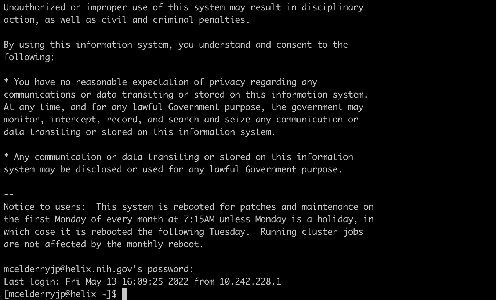

This practical section will focus first on connecting to a remote cluster
as well as using the linux command line. Then we will practice working with
some common bioinformatics file formats.

## Setup ssh connection

First, to use the computing clusters we need to establish an ssh connection
between your computer and the cluster. The steps to do this will differ
depending on whether you're using MacOS or Windows:

#### MacOS

- Open the Terminal app, like so:
	- "Finder -> Applications -> Utilities -> Terminal"
- enter the following command: <code>ssh username@helix.nih.gov</code>,
replacing 'username' with your own username.

#### Windows

- Install [PuTTY](https://www.chiark.greenend.org.uk/~sgtatham/putty/latest.html)
- Launch PuTTY. Under “Host Name (or IP address), type:
<code>username@helix.nih.gov</code>, replacing 'username' with your own username,
and click “Open”
- At the prompt, enter the account password

At this point you should be connected to the NIH Helix cluster, and your screen
should look something like this:

## Basic Bash/Linux commands
