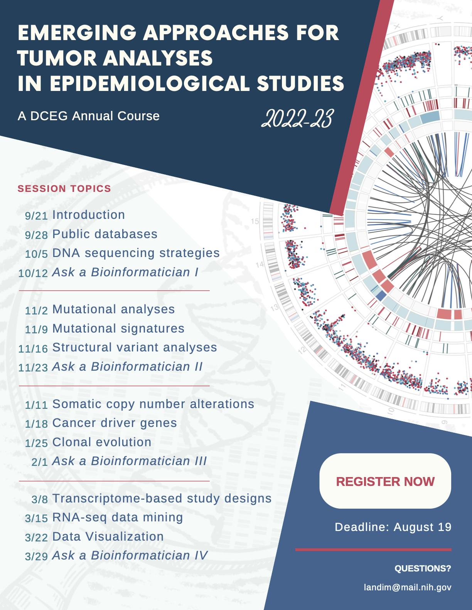

# Save the Dates!

The dates for all 12 sessions in the
 *Emerging Approaches for Tumor Analyses in Epidemiological Studies* course have been finalized!
Please mark them down in your calendar so you can be sure not to miss them.

All sessions begin at 9:30am with a lecture component ending at 10:30, usually followed by a practical session ending at 12pm.
Help sessions with Sherlock bioinformaticians will run for 2 hours from 9:30am to 11:30am.

Sign up for the course using [this google form]() if you haven't already. Those who participate in all lectures and practical sessions will receive a certificate of completion for the course suitable for your CV/resume.
