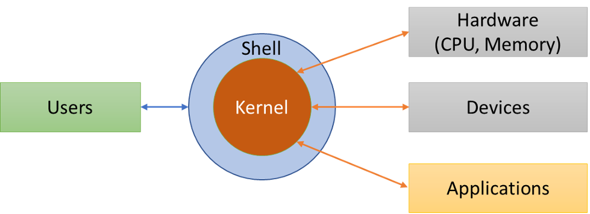
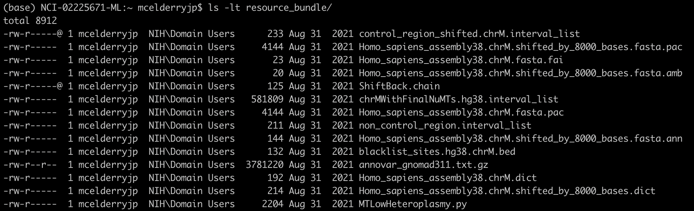

<a href="https://github.com/NCI-ITEB/tumor_epidemiology_approaches_materials/raw/main/lecture_materials/lecture_1/Session%201_%20Basic%20Introduction%20(final).pdf" target="_blank">Download the original slides for this lecture here</a>

## Introduction to Available Computing Clusters

We will first begin by discussing two computing clusters at NIH: CCAD and Biowulf. As this is a course from DCEG, we will open this section with a brief description of the Computer Cluster at DCEG (CCAD). CCAD is a cluster only for DCEG members. This is mostly optional information for interested DCEG members as all following practical and lecture sessions will focus on Biowulf when cluster use is required.

---

### Computer Cluster at DCEG (CCAD)

CCAD is the dedicated computing cluster for DCEG. CCAD operates under a fair use policy to avoid monopolization of resources. In other words, users are given equal access to the available resources as they become available.  

For example, say the job queue is empty and User A submits 8 jobs to the cluster  which can run 5 jobs at any time.  The first 5 of User A's jobs are then started while the other 3 remain in the queue.  Meanwhile User B submits 1 job which is put in the queue after User A's 3 remaining jobs.  When one of User A's jobs completes, User B's job will then be run despite being entered into the queue after User's A's to ensure fair use. Job scheduling and fair use assurance is managed automatically using the Sun Grid Engine management software, through which all jobs must be submitted.

The two types of cluster use include interactive sessions and cluster jobs.



Interactive sessions allow for actions to be performed on the command line after logging into the cluster. Logging onto CCAD logs a user onto a specialized login node which provides a place for interactive use but does not actively control the CCAD cluster. Cluster jobs are the primary and preferred method of using CCAD in which users submit a job to a queueing system to be run when resources become available, according to fair use.

For your reference, here are the resources available at CCAD:



<!---

### Submitting a Job to CCAD
- Log in to the cluster:

<code>ssh ccad.nci.nih.gov</code>

- Load Sun Grid Engine module (contains commands needed to submit jobs)

<code>module load sge</code>
- Set up a script to submit with the job- specify qsub options in the script, or specify on the command line

<code>qsub -N jobname -e error.e -o output.o myscript.sh</code>

- Check the status of a job

<code>qstat</code>
-->

---

#### Additional CCAD Resources

- Additional CCAD information can be found at [myDCEG](https://nih.sharepoint.com/sites/NCI-DCEG-myDCEG/_layouts/15/search.aspx/siteall?q=ccad):

- [Cluster Use Policies](https://nih.sharepoint.com/sites/NCI-DCEG-myDCEG/SitePages/Cluster-Use-Policies.aspx)

- [Cluster Nodes and Memory](https://nih.sharepoint.com/sites/NCI-DCEG-myDCEG/SitePages/Cluster-Nodes-and-Memory.aspx)

- [Beginner User Guide](https://nih.sharepoint.com/sites/NCI-DCEG-myDCEG/SitePages/Beginner-User-Guide.aspx)

- [CCAD Account Request
Form](https://nih.sharepoint.com/:w:/r/sites/NCI-DCEG-myDCEG/_layouts/15
/Doc.aspx?sourcedoc=%7B18D58A8D-2DF0-41E8-A2BA-B7AB42F745EC%7D&file=CCAD
-Account-Request-Form.docx&action=default&mobileredirect=true&
DefaultItemOpen=1)

---

### Biowulf

As compared to CCAD, Biowulf is a much larger computer cluster available to all of NIH.

*from https://hpc.nih.gov/systems/*

Like CCAD, Biowulf also operates under a fair use policy by which jobs are prioritized according to each user's recent usage volume, measured in CPU-hours. If cluster resources are in high demand, users with lower recent usage (measured in CPU-hours) have their jobs prioritized over users with high recent usage. Jobs are scheduled automatically using a workload management software called Slurm, analogous to the Sun Grid Engine noted for CCAD.

Note that, like CCAD, there is a login node in on the cluster. This login node is what you are operating immediately when you login to Biowulf, and ***it is shared among all users***. For this reason, scientific applications and other computation-intensive processes must be run via job submission or others will be unable to use the cluster.

Biowulf is one of the top 500 most powerful clusters in the world, featuring:
- 100,000+ cores
- 200,000+ CPUs
- 4,000+ nodes
- 900+ TB memory
- 3+ PB local scratch (lscratch)
- ~40 PB high performance storage
- 5 PB object storage
- 800+ GPUs (4,000,000+ CUDA cores)

Biowulf offers many versions of over 1000 scientific applications, and maintains data from several public databases for user convenience such as reference genomes, NCBI nt Blast database, NCBI taxonomy database, ClinVar, gnomAD, etc. Biowulf also features many versions of both python and R with over 500 and 1600 packages installed, respectively, and supports containerization using Singularity.

For information on using Biowulf, see the [Biowulf
website](https://hpc.nih.gov/) which contains tons of great information.
In particular, we want to highlight the in-depth [education and
training](https://hpc.nih.gov/training/) resources on everything from
basic linux to advanced scripting for Biowulf, and also see the detailed
[guides for using individual scientific softwares](https://hpc.nih.gov/apps).

---

#### Additional Biowulf Resources

- [Biowulf website](https://hpc.nih.gov/)

- [Biowulf online classes and monthly zoom-in consults](https://hpc.nih.gov/training/)

- Submit help tickets: send email to staff@hpc.nih.gov

---

### Comparison of Biowulf and CCAD

Here is a table to summarise and highlight the differences between working with CCAD and Biowulf:

|     |Biowulf    | CCAD      |
| ----: | ----------- | ----------- |
| Job submission | <code>sbatch --cpus-per-task=# --mem=#g --job-name #JobName --time ##:##:## myscript.sh  swarm -g #memory -t #threads -b #bundle --job-name #JobName --time ##:##:##  myscript.sh </code> | <code>module load sge qsub -N JobName -e error.e -o output.o --cpus-per-task # --mem #g myscript.sh</code> |
| Interactive jobs | <code>sinteractive --cpus-per-task=#cpus --mem=#g</code> | <code>module load sge qlogin [options], qsh</code> |
| Cancel jobs | <code>scancel #job-id scancel --name=#JobName</code> | <code>qdel job_id [options]</code> |
| Monitor jobs | <code>squeue</code>, <code>sjobs</code>, <code>jobload</code>, <code>jobhist</code> | <code>qstat</code> |
| Transfer data | Globus, WinSCP/Fugu | <code>scp</code>, <code>rsync</code> |
| Load applications | <code>module spider #module module load #module</code> | <code>module load #module</code> |

#### Snapshots

Snapshots are a read-only copy of data at a particular point in time. These snapshots are very helpful if you inadvertently delete a file that you need. To locate the file you are interested in, you can go to a specific snapshot by using the following command:

<code>cd .snapshot</code>

This will take you to a main snapshot directory that contains all of the other snapshot directories. From there you can find the file you need and copy it back to the desired directory.

Here are the policies of both clusters on snapshots:

| Biowulf    | CCAD      |
| ----------- | ----------- |
| - Home dir: Weekly backups, with daily incremental backups  - Data dir: NOT BACKED UP  - Buy-in storage  - Additional information: [File Backups and Snapshots on the HPC Systems](https://hpc.nih.gov/storage/backups.html) | - Nightly snapshots last one week - 6 hour snapshots last 3 days - True backups done via CBIIT taken weekly and retained based on their policies - Permanent backups need to be requested to be transferred to the archive |

More information on Biowulf snapshots can be found here: <a href="https://hpc.nih.gov/storage/backups.html" target="_blank">https://hpc.nih.gov/storage/backups.html</a>.

---

## Cluster How-Tos: Connect, Transfer Files/Share Data

CCAD and Biowulf are primarily accessed for one of two purposes: direct use of the cluster or transferring files. Here we will summarise how to do both.

|   Host   |       Hostname       | Accessible by |      Purpose      |
|:--------:|:--------------------:|:-------------:|:-----------------:|
|  **Biowulf** |    biowulf.nih.gov   | All HPC users | cluster head node |
|   **Helix**  |     helix.nih.gov    | All HPC users |   data transfer   |
| **HPCdrive** |   hpcdrive.nih.gov   | All HPC users |   data transfer   |
|   **CCAD**   |   ccad.nci.nih.gov   | All HPC users | cluster head node |
|  **CCAD Tdrive**  | gigantor.nci.nih.gov | All HPC users |   data transfer   |

---

### Connecting via SSH

The only method for directly accessing either cluster is ultimately through the command line. This is done via secure shell, or SSH.

Connecting via SSH will vary depending on whether you’re using a MacOS or Windows computer to connect. Windows users will need to install [PuTTY](https://www.chiark.greenend.org.uk/~sgtatham/putty/latest.html) to connect via SSH.

  <figure>
    {% include image-modal.html max-width="95%" link="lecture_assets/putty.png" %}
    <figurecaption class="is-italic">PuTTy configuration menu</figurecaption>
  </figure>
  <figure>
    {% include image-modal.html max-width="95%" link="lecture_assets/putty_login.png" %}
    <figurecaption class="is-italic">Logging into Biowulf using PuTTY</figurecaption>
  </figure>

If you are using a Mac, no additional software is necessary. Simply open the Mac app Terminal and type <code>ssh -Y [user]@biowulf.nih.gov</code>, where [user] is your login ID.

{% include image-modal.html classes="center" styles="display: block;margin-left: auto; margin-right: auto; max-width: 66%" link="lecture_assets/mac_ssh.png" %}

Note: -Y enables trusted X11 forwarding. X11 forwarding allows for the use of graphical applications on a remote server (ex. Integrative Genomics Viewer- IGV). Another option for running graphics applications is NoMachine (NX) (<a target="_blank" href="https://hpc.nih.gov/docs/nx.html#setup">https://hpc.nih.gov/docs/nx.html#setup</a>).

We will detail and practice connecting to CCAD and Biowulf further in the practical section.

---

Transfer of files can be accomplished one of many ways:

### Graphical User Interface (GUI) file transfer applications

GUI-based transfer applications can be a convenient way to transfer data. [WinSCP](link) for Windows and [FileZilla](link) for both Windows and MacOS are free applications recommended for file transfers.

  

    {% include image-modal.html max-width="95%" link="lecture_assets/winscp_menu.png" %}
    <figurecaption class="is-italic" style="text-align:center">WinSCP login window</figurecaption>
  

  

    {% include image-modal.html max-width="95%" link="lecture_assets/winscp_transfer.png" %}
    <figurecaption class="is-italic" style="text-align:center">File transfer with WinSCP</figurecaption>
  

<figure>
{% include image-modal.html classes="center" styles="display: block;margin-left: auto; margin-right: auto; max-width: 66%" link="lecture_assets/filezilla_example.png" %}
<figurecaption>File transfer with FileZilla</figurecaption>
</figure>

---

### Mounting drives

Drives from the NIH HPC and CCAD can be mounted directly to your local computer which allows you to click and drag files in familiar fashion. This is best only for small file transfers; transfer of larger files should be done through another method.



Doing so will require you to specify a folder to be mounted. Refer to the table below for the correct path formatting.

| | Description | Directory at cluster | SMB path for Windows | SMB path for Mac |
| ---: | --- | --- | --- | --- |
| **Biowulf/Helix** | user's home directory | /home/[user] | \\\\hpcdrive.nih.gov\\[user] | smb://hpcdrive.nih.gov/[user] |
| | data directory | /data/[user] | \\\\hpcdrive.nih.gov\\data | smb://hpcdrive.nih.gov/data |
| | user's scratch space | /scratch/[user] directory | \\\\hpcdrive.nih.gov\\scratch\\[user] | smb://hpcdrive.nih.gov/scratch/ [user] |
| | shared group area (e.g. you are a member of group PQRlab) | /data/PQRlab | \\\\hpcdrive.nih.gov\\PQRlab | smb://hpcdrive.nih.gov/PQRlab |
| **CCAD** | main directory | /home/ | \\\\gigantor.nci.nih.gov\\ifs | smb://gigantor.nci.nih.gov/ifs |
| | user's home directory | /home/[user] | \\\\gigantor.nci.nih.gov\\ifs \\DCEG\\Home\\[user] | smb://gigantor.nci.nih.gov/ifs /DCEG/Home/[user] |

. For more detailed instructions on how to mount drives on Biowulf, see [here](https://hpc.nih.gov/docs/transfer.html).

---

### Globus file transfer

Globus is the recommended method to transfer and share files from Biowulf. Globus has the ability to monitor transfer performance, retry failures, recover from faults automatically, and report transfer status. See [here](https://hpc.nih.gov/storage/globus.html) for how to set up a Globus account.

{% include image-modal.html classes="center" link="lecture_assets/globus_login.png" styles="max-width:60%; height:auto; display: block;margin-left: auto; margin-right: auto;" %}

---

### Command line file transfer

Finally one can use the command line to transfer files using the secure FTP (Windows via PuTTY) and secure copy (Windows via PuTTY, MacOS) commands, like so to transfer to the HPC:

>*Windows via PuTTY:*
><code>pscp source_folder/my_file_1.txt username@helix.nih.gov:/destination_folder</code>
>
>*MacOS:*
><code>scp source_folder/my_file_1.txt username@helix.nih.gov:/destination_folder</code>

Or conversely from the HPC:

>*Windows via PuTTY:*
><code>pscp username@helix.nih.gov:/source_folder/my_file_2.txt destination_folder</code>
>
>*MacOS:*
><code>scp username@helix.nih.gov:/source_folder/my_file_2.txt destination_folder</code>

. Note that these commands use the Helix system, not Biowulf (as designated by @helix.nih.gov). Biowulf should not be used for file transfers unless done from within a job on the cluster.

---

## Basic Linux Commands

### Linux Programming

Because CCAD and Biowulf must be accessed via the command line it is necessary to know some linux before using either. We’ve already discussed a few command line programs such as <code>ssh</code> for connecting to the clusters and <code>scp</code> for file transfer, but more is required to operate them. We will cover some of the most useful commands in the practical section for this session.

<!--
All programming with CCAD and Biowulf is done through the linux 'shell'.

The shell in linux is a high-level programming language, meaning that it does not interact directly with the computer’s hardware. Instead, the linux shell interprets code into instructions and interfaces with a low-level programming language called the ‘kernel’ which directly controls computer hardware. This eliminates the need for users to explicitly program basic hardware management, making shell programming a dramatically more convenient experience.

Also note that this architecture is not unique to linux, virtually all popular operating systems use this same or similar architecture. Both CCAD and Biowulf use the ‘Bash’ shell, as do most linux computers.

Commands to the shell generally follow a standard anatomy, as follows:

. The prompt is a symbol the command line presents to the user indicating that the machine is ready to accept commands. Commands are entered in the order: command, options (indicated by a preceding ‘-’), and argument(s).

The command above uses an ‘ls’ command which lists the files in a folder provided by the ‘argument’, in this case <code>/home/$USER</code>. By default this will simply print the names of the files, but the options ‘-l’ and ‘-t’ (combined above to simply ‘-lt’) tell the command to also include extra information such as file size, file creator, access permissions, etc. and then sort them by time last modified, respectively.

-->
<!---

### Scripting

Issuing commands one at a time is a convenient way to browse the Biowulf file system and inspect files. There are often instances where issuing commands one at a time is inconvenient, however, such as when issuing many commands in succession or when the same set of instructions are issued repeatedly. In these instances commands can be bundled into a script which are passed to the shell and run automatically. Submitting scripts is also the preferred way to submit jobs to both CCAD and Biowulf as opposed to requesting interactive sessions.

Above is an example of a short script. The first line tells the shell what language the script is in. In this case it’s a Bash script. The line below, <code>module load samtools</code> loads the bioinformatics software ‘samtools’ for use. The lines after perform a variety of functions using standard linux commands, such as making a new folder and copying some data to it.

Note the ‘#’ symbols at each line in the script beyond the first. These symbols indicate a comment, and all text on a line following a <code>#</code> is ignored by the shell. This provides users with the opportunity to leave notes on their code, which can be invaluable when sharing code with others or as a refresher when revisiting old code.

---

### Text Editors
In order to write a script you must of course use a text editor. While you can write scripts using an application on your local computer and transfer them to a cluster, it is far more convenient to write the scripts on the cluster itself. Options for text editors within Biowulf include ‘vi’ and ‘vim’, ‘emacs’, and ‘nano’ which are all opened directly on the command line. This session’s practical section will include an introduction to ‘vim’.

If a GUI is a must, ‘Atom’ is a modern text editor available on Biowulf, though using it requires connecting to Biowulf through a graphical interface and requesting an interactive session. It is thus slightly impractical for daily use and best reserved for writing complex scripts.
-->

For now, to learn more about linux please see this <a target="_blank" href="https://github.com/NCI-ITEB/tumor_epidemiology_approaches_materials/raw/main/lecture_materials/lecture_1/Linux_bash%20commands.pdf">linux cheatsheet</a> and <a target="_blank" href="https://github.com/NCI-ITEB/tumor_epidemiology_approaches_materials/raw/main/lecture_materials/lecture_1/Vim%20editor%20comands.pdf">vim cheatsheet</a> we've prepared for your reference, and/or view these external resources:

- [Biowulf’s ‘Introduction to Linux’](https://hpc.nih.gov/training/handouts/Introduction_to_Linux.pdf)
- [Biowulf’s ‘Introduction to Bash Scripting’](https://hpc.nih.gov/training/handouts/BashScripting.pdf)
- [Biowulf’s online classes for Bash](https://hpc.nih.gov/training/bash_class/)
- [Biowulf’s Linux and Slurm cheatsheet](https://hpc.nih.gov/training/handouts/BashScripting_LinuxCommands.pdf)
- [Vim documentation](https://www.vim.org/docs.php )
- [Cheatsheet for Vim](https://vimsheet.com)

---

## Bioinformatics File Formats and Tools

Finally we will discuss some of the most important file formats used in bioinformatics. These file formats will include the ones you are likely to encounter in a typical genomics study, but there are still many more specialized file formats which we won’t cover in this session.

Before we describe these file formats in more detail, below is a workflow diagram tracing the flow of information over the course of a cancer study and a slightly more detailed description of each format in the table below.



---

### Raw Data

Sequencing data with per-base quality score is stored in one of two forms: fastq (raw reads), SAM/BAM/CRAM (aligned reads).

Fastq is the most basic sequencing format and stores only sequence barcodes, sequenced bases, and per-base quality scores. 1 nucleotide base in fastq format is stored in ~2 bytes (sequence + quality score). Bearing in mind that the human genome itself is 3GBs, one 30x whole genome sequencing sample= 3GB * 30x * 2 bytes per base ~ 180GB. Compressing fastq files typically compresses to 25% original size.

Fastq sequencing files which are aligned to reference genomes are stored as alignment files in SAM/BAM/CRAM format. SAM (Sequence Alignment Map) is a human-readable, uncompressed alignment file, whereas BAM and CRAM are both compressed forms of SAM. BAM/CRAM files are considerably smaller than SAM files and are therefore the most common alignment formats for data sharing and deposit.

BAM is a lossless compression; this means that the original SAM is always perfectly reconstructed during decompression. CRAM offers a greater degree of compression from BAM, and can be either lossless or lossy (i.e. some information may be lost during decompression).



---

### Processed Data

Variants calling results can be shared in the formats of VCF or MAF. In somatic genomic studies, each VCF file is generated for one tumor/normal pair. In germline studies it on VCF contains pooled variants for all samples.



MAF files contain aggregated mutation information from VCF files and are generated on a project-level. MAF files also include annotation of variants from public databases.



<!--For more information on these and other file formats, see [here](https://bioinformatics.uconn.edu/resources-and-events/tutorials-2/file-formats-tutorial/).-->

---

### Preparing Data for Database Submission

- NCBI Sequence Read Archive (SRA)
  - requires raw data with per-base quality scores for all submitted data.
  - accepts binary files such as BAM/CRAM, HDF5 (for PacBio, Nanopore), SFF (when BAM is not available, for 454 Life Science and Ion Torrent data), and text formats such as FASTQ.
  - For more information: <a target="_blank" href="https://www.ncbi.nlm.nih.gov/sra/docs/submit/">https://www.ncbi.nlm.nih.gov/sra/docs/submit/</a>
- Gene Expression Omnibus (GEO)
  - studies concerning quantitative gene expression, gene regulation, epigenetics, or other functional genomic studies. (e.g. mRNA-seq, miRNA-seq, ChIP-Seq, HiC-seq, methyl-seq/bisulfite-seq)
  - does NOT accept WGS, WES, metagenomic sequencing, or variation or copy number projects.
  - a complete submission includes: metadata, processed data, raw data containing sequence reads and quality scores (will be submitted to SRA by the GEO team)
  - For more information: <a target="_blank" href="https://www.ncbi.nlm.nih.gov/geo/info/seq.html">https://www.ncbi.nlm.nih.gov/geo/info/seq.html</a>
- The database of Genotypes and Phenotypes (dbGaP)
  - studies investigating the interaction of genotype and phenotype in humans.
  - all submissions that require controlled access must be submitted through dbGaP.
  - requires registration of the study and subjects prior to data submission.
  - raw data will be submitted to the protected SRA account.
  - For more information: <a target="_blank" href="https://www.ncbi.nlm.nih.gov/sra/docs/submitdbgap/">https://www.ncbi.nlm.nih.gov/sra/docs/submitdbgap/</a>

---

### File formats

Finally, we present a summary table of the bioinformatics file formats and what tools are available to work with them:

| Format name  | Data type | Tools |
|--------------:|----------------------------------------------------------------------------------------------------------------------|------------------------------------------------------|
| SRA | a raw data archive with per-base quality score | <a target="_blank" href="https://github.com/ncbi/sra-tools">sra-tools</a> |
| FASTA | a text file of reference genome sequence data | <a target="_blank" href="https://www.ncbi.nlm.nih.gov/CBBresearch/Spouge/html_ncbi/html/fasta/list.html">FASTA Tools</a> |
| FASTQ | a text file of sequencing data with quality score | <a target="_blank" href="https://www.bioinformatics.babraham.ac.uk/projects/fastqc/">FastQC</a>, <a target="_blank" href="http://hannonlab.cshl.edu/fastx_toolkit/index.html">FASTX-Toolkit</a>, <a target="_blank" href="https://docs.csc.fi/apps/seqtk/">Seqtk</a>, <a target="_blank" href="http://www.htslib.org/doc/samtools.html">Samtools</a>, <a target="_blank" href="https://broadinstitute.github.io/picard/">Picard tools</a> |
| SAM/BAM/CRAM | formats of sequence alignment data | <a target="_blank" href="http://www.htslib.org/doc/samtools.html">Samtools</a>, <a target="_blank" href="https://broadinstitute.github.io/picard/">Picard tools</a> |
| BCF/VCF/gVCF | a tab-delimited text file to store the variation calls | <a target="_blank" href="http://samtools.github.io/bcftools/">bcftools</a> |
| BED (PEBED) | a tab-delimited text file to store the coordinates of genomic regions. | <a target="_blank" href="https://bedtools.readthedocs.io/en/latest/">bedtools</a> |
| GTF/GFF/GFF3 | a tab-delimited text file to describe genes or other features | <a target="_blank" href="http://biowiki.org/wiki/index.php/Gff_Tools">gff tools</a>, <a target="_blank" href="http://ccb.jhu.edu/software/stringtie/gff.shtml">GFF utilities (gffread, gffcompare)</a> |
| MAF | a tab-delimited text file with aggregated mutation information from VCF files and are generated on a project-level. | <a target="_blank" href="https://bioconductor.org/packages/release/bioc/vignettes/maftools/inst/doc/maftools.html">MAFtools</a> |

---

### Additional Resources

For full descriptions of aforementioned formats as well as tools to work with them, see the resources below as well as the supplementary information tab for this session.

- [UConn file formats guide ](https://bioinformatics.uconn.edu/resources-and-events/tutorials-2/file-formats-tutorial/)
- [Explain SAM/BAM Alignment Flags](https://broadinstitute.github.io/picard/explain-flags.html)
- [CIGAR string formatting](https://genome.sph.umich.edu/wiki/SAM#What_is_a_CIGAR.3F)
- [Samtools docs on file formats](https://samtools.github.io/hts-specs/)
- [UCSC file format descriptions](https://genome.ucsc.edu/FAQ/FAQformat.html)
