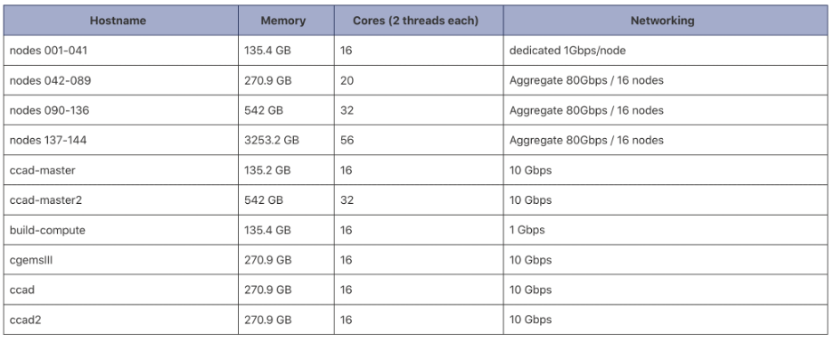
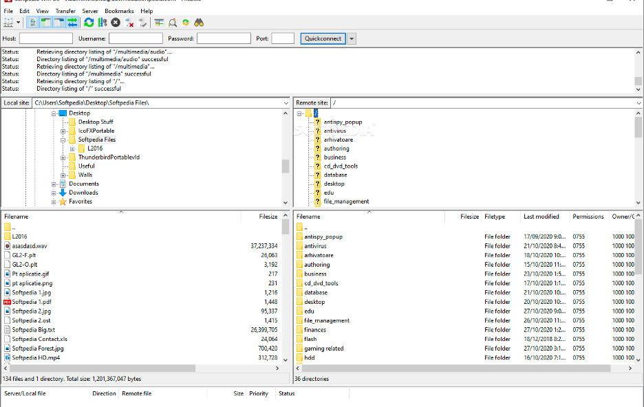
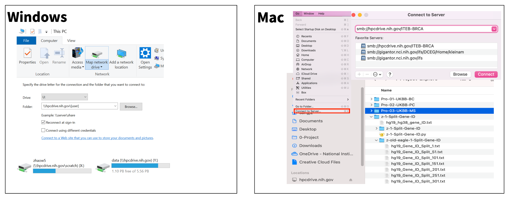
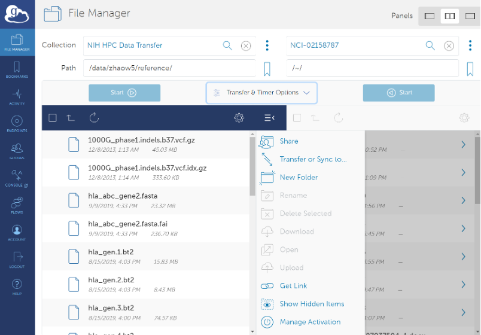
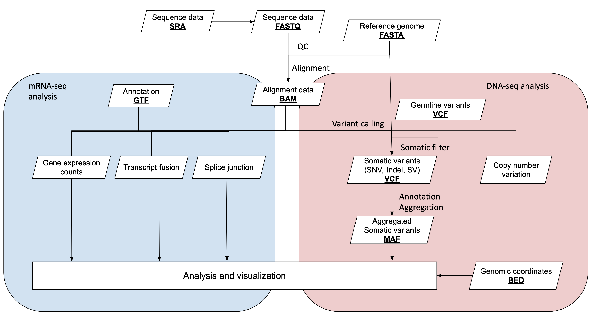

## Introduction to Available Computing Clusters

We will first begin by discussing two computing clusters at NIH: CCAD and Biowulf. Biowulf is the NIH's main computer cluster and one of the 500 largest computing clusters in the world as of this writing.

As this is a course from DCEG, we will open this section with a brief description of the Computer Cluster at DCEG (CCAD). This information is primarily for interested DCEG members as the majority of this course and all of the practical sections will focus on Biowulf.

### Computer Cluster at DCEG (CCAD)

CCAD is the dedicated computing cluster for DCEG. CCAD operates under a fair use policy to avoid monopolization of resources. In other words, users are given equal access to the available resources as they become available.  

For example, say the job queue is empty and User A submits 8 jobs to the cluster  which can run 5 jobs at any time.  The first 5 of User A's jobs are then started while the other 3 remain in the queue.  Meanwhile User B submits 1 job which is put in the queue after User A's 3 remaining jobs.  When one of User A's jobs completes, User B's job will then be run despite being entered into the queue after User's A's to ensure fair use. Scheduling is managed automatically using the Sun Grid Engine management software, through which all jobs must be submitted.

The two types of cluster use include interactive sessions and cluster jobs. Interactive sessions allow for actions to be performed on the command line after logging into the cluster. Logging onto CCAD logs a user onto a specialized login node which provides a place for interactive use but does not actively control the CCAD cluster. Cluster jobs are the primary and preferred method of using CCAD in which users submit a job to a queueing system to be run when resources become available, according to fair use.

| Interactive Use | Cluster Jobs  |
| --------------- | ------------- |
| actions performed on the command line after logging in | submitting a job to a queueing system that is then run independently of user interaction |

### Submitting a Job to CCAD
- Log in to the cluster:

<code>ssh ccad.nci.nih.gov</code>

- Load Sun Grid Engine module (contains commands needed to submit jobs)

<code>module load sge</code>
- Set up a script to submit with the job- specify qsub options in the script, or specify on the command line

<code>qsub -N jobname -e error.e -o output.o myscript.sh</code>

- Check the status of a job

<code>qstat</code>

#### Additional CCAD Resources

- Additional CCAD information can be found at [myDCEG](https://nih.sharepoint.com/sites/NCI-DCEG-myDCEG/_layouts/15/search.aspx/siteall?q=ccad):

- [Cluster Use Policies](https://nih.sharepoint.com/sites/NCI-DCEG-myDCEG/SitePages/Cluster-Use-Policies.aspx)

- [Cluster Nodes and Memory](https://nih.sharepoint.com/sites/NCI-DCEG-myDCEG/SitePages/Cluster-Nodes-and-Memory.aspx)

- [Beginner User Guide](https://nih.sharepoint.com/sites/NCI-DCEG-myDCEG/SitePages/Beginner-User-Guide.aspx)

- [CCAD Account Request
Form](https://nih.sharepoint.com/:w:/r/sites/NCI-DCEG-myDCEG/_layouts/15
/Doc.aspx?sourcedoc=%7B18D58A8D-2DF0-41E8-A2BA-B7AB42F745EC%7D&file=CCAD
-Account-Request-Form.docx&action=default&mobileredirect=true&
DefaultItemOpen=1)

### Biowulf

As compared to CCAD, Biowulf is a much larger computer cluster available to all of NIH. Biowulf features a total of 100,000+ computing cores, 920 TB of memory, and over 30 PB of data storage.

*from https://hpc.nih.gov/systems/*

Like CCAD, Biowulf also operates under a fair use policy by which jobs are prioritized according to each user's recent usage volume, measured in CPU-hours. If cluster resources are in high demand, users with lower recent usage have their jobs prioritized over users with high recent usage. Jobs are scheduled automatically using a workload management software called Slurm, analogous to the Sun Grid Engine noted for CCAD.

Note that, like CCAD, there is both a login node separate from the cluster. This login node is what you are operating when you first login to Biowulf, and ***it is shared among all users***. For this reason, scientific applications and other taxing processes must be run in a script or an interactive session to avoid affecting others.

Biowulf offers many versions of over 1000 scientific applications, and maintains data from several public databases for user convenience such as reference genomes, NCBI nt Blast database, NCBI taxonomy database, ClinVar, gnomAD, etc. Biowulf also features many versions of both python and R with over 500 and 1600 packages installed, respectively.

For information on using Biowulf, see the [Biowulf
website](https://hpc.nih.gov/) which contains tons of great information.
In particular, we want to highlight the in-depth [education and
training](https://hpc.nih.gov/training/) resources on everything from
basic linux to advanced scripting for Biowulf, and also see the detailed
[guides for using individual scientific softwares](https://hpc.nih.gov/apps)
which are invaluable resources.

#### Additional Biowulf Resources

- [Biowulf website](https://hpc.nih.gov/)

- [Biowulf online classes](https://hpc.nih.gov/training/ )

- Submit help tickets: Send email to staff@hpc.nih.gov

- [Monthly zoom-in consults](https://hpc.nih.gov/training/)

### Comparison of Biowulf and CCAD

Lastly, we provide a table summarizing the details of each cluster to
highlight the unique aspects of each:

|     |Biowulf    | CCAD      |
| ----: | ----------- | ----------- |
| Job submission | <code>sbatch --cpus-per-task=# --mem=#g --job-name #JobName --time ##:##:## myscript.sh  swarm -g #memory -t #threads -b #bundle --job-name #JobName --time ##:##:##  myscript.sh </code> | <code>module load sge qsub -N JobName -e error.e -o output.o --cpus-per-task # --mem #g myscript.sh</code> |
| Interactive jobs | <code>sinteractive --cpus-per-task=#cpus --mem=#g</code> | <code>module load sge qlogin [options], qsh</code> |
| Cancel jobs | <code>scancel #job-id scancel --name=#JobName</code> | <code>qdel job_id [options]</code> |
| Monitor jobs | <code>squeue</code>, <code>sjobs</code>, <code>jobload</code>, <code>jobhist</code> | <code>qstat</code> |
| Transfer data | Globus, WinSCP/Fugu | <code>scp</code>, <code>rsync</code> |
| Load applications | <code>module spider #module module load #module</code> | <code>module load #module</code> |
| Backup policy | - Home dir: Weekly backups, with daily incremental backups  - Data dir: NOT BACKED UP  - Buy-in storage  - Additional information: [File Backups and Snapshots on the HPC Systems](https://hpc.nih.gov/storage/backups.html) | - Nightly snapshots last one week - 6 hour snapshots last 3 days - True backups done via CBIIT taken weekly and retained based on their policies - Permanent backups need to be requested to be transferred to the archive |

---

## Cluster How-Tos: Connect, Transfer Files/Share Data

CCAD and Biowulf are primarily accessed for one of two purposes: direct use of the cluster or transferring files.

| Host | Hostname | Accessible by | Purpose |
| :---: | :---: | :---: | :---: |
| Helix | helix.nih.gov | All HPC Users | data transfer |
| Biowulf | biowulf.nih.gov | All HPC Users | cluster headnode |
| CCAD | ccad.nci.nih.gov | All HPC Users | cluster headnode |

### Connecting via SSH

The only method for directly accessing either cluster is ultimately through the command line. This is done via secure shell, or SSH. Connecting via SSH will vary depending on whether you’re using a MacOS or Windows computer to connect. MacOS computers have SSH functionality out of the box whereas Windows users will need to install [PuTTY](https://www.chiark.greenend.org.uk/~sgtatham/putty/latest.html) to connect. We will discuss connecting to CCAD and Biowulf further in the practical session.

Transfer of files can be accomplished one of many ways.

### Graphical User Interface (GUI) file transfer applications

GUI-based transfer applications can be a convenient way to transfer data. [WinSCP](link) for Windows and [FileZilla](link) for both Windows and MacOS are free applications recommended for file transfers.

*An example of transferring files with FileZilla.*

### Mounting drives

Drives from the NIH HPC and CCAD can be mounted directly to your local computer which allows you to click and drag files in familiar fashion. This is best only for small file transfers; transfer of larger files should be done through another method.

Doing so will require a path to the drive to be mounted. Refer to the table below for the correct path formats.

| | Description | Directory at cluster | SMB path for Windows | SMB path for Mac |
| --- | --- | --- | --- | --- |
| Biowulf/Helix | user's home directory | /home/[user] | \\\\hpcdrive.nih.gov\\[user] | smb://hpcdrive.nih.gov/[user] |
| | data directory | /data/[user] | \\\\hpcdrive.nih.gov\\data | smb://hpcdrive.nih.gov/data |
| | user's scratch space | /scratch/[user] directory | \\\\hpcdrive.nih.gov\\scratch\\[user] | smb://hpcdrive.nih.gov/scratch/ [user] |
| | shared group area (e.g. you are a member of group PQRlab) | /data/PQRlab | \\\\hpcdrive.nih.gov\\PQRlab | smb://hpcdrive.nih.gov/PQRlab |
| CCAD | main directory | /home/ | \\\\gigantor.nci.nih.gov\\ifs | smb://gigantor.nci.nih.gov/ifs |
| | user's home directory | /home/[user] | \\\\gigantor.nci.nih.gov\\ifs \\DCEG\\Home\\[user] | smb://gigantor.nci.nih.gov/ifs /DCEG/Home/[user] |

. For more detailed instructions on how to mount drives, see [here](https://hpc.nih.gov/docs/transfer.html).

### Globus file transfer

Globus is the recommended method to transfer and share files from Biowulf. Globus has the ability to monitor transfer performance, retry failures, recover from faults automatically, and report transfer status. See [here](https://hpc.nih.gov/storage/globus.html) for how to set up a Globus account.

### Command line file transfer

Finally one can use the command line to transfer files using the secure FTP (Windows via PuTTY) and secure copy (Windows via PuTTY, MacOS) commands, like so to transfer to the HPC:

>*Windows via PuTTY:*
><code>pscp source_folder/my_file_1.txt username@helix.nih.gov:/destination_folder</code>
>
>*MacOS:*
><code>scp source_folder/my_file_1.txt username@helix.nih.gov:/destination_folder</code>

Or conversely from the HPC:

>*Windows via PuTTY:*
><code>pscp username@helix.nih.gov:/source_folder/my_file_2.txt destination_folder</code>
>
>*MacOS:*
><code>scp username@helix.nih.gov:/source_folder/my_file_2.txt destination_folder</code>

. Note that these commands use the Helix system, not Biowulf (as designated by @helix.nih.gov). Biowulf should not be used for file transfers unless done from within an interactive job on the cluster.

---

## Basic Linux Commands

### Linux Programming

Because CCAD and Biowulf must be accessed via the command line it is necessary to know some linux before using either. We’ve already discussed a few command line programs such as <code>ssh</code> for connecting to the clusters and <code>scp</code> for file transfer, but more is required to operate them. We will cover some of the most useful commands in the practical section for this session.

All programming with CCAD and Biowulf is done through the linux 'shell'.

The shell in linux is a high-level programming language, meaning that it does not interact directly with the computer’s hardware. Instead, the linux shell interprets code into instructions and interfaces with a low-level programming language called the ‘kernel’ which directly controls computer hardware. This eliminates the need for users to explicitly program basic hardware management, making shell programming a dramatically more convenient experience.

Also note that this architecture is not unique to linux, virtually all popular operating systems use this same or similar architecture. Both CCAD and Biowulf use the ‘Bash’ shell, as do most linux computers.

Commands to the shell generally follow a standard anatomy, as follows:

. The prompt is a symbol the command line presents to the user indicating that the machine is ready to accept commands. Commands are entered in the order: command, options (indicated by a preceding ‘-’), and argument(s).

 The command above uses an ‘ls’ command which lists the files in a folder provided by the ‘argument’, in this case <code>/home/$USER</code>. By default this will simply print the names of the files, but the options ‘-l’ and ‘-t’ (combined above to simply ‘-lt’) tell the command to also include extra information such as file size, file creator, access permissions, etc. and then sort them by time last modified.

### Scripting

Issuing commands one at a time is a convenient way to browse the Biowulf file system and inspect files. There are often instances where issuing commands one at a time is inconvenient, however, such as when issuing many commands in succession or when the same set of instructions are issued repeatedly. In these instances commands can be bundled into a script which are passed to the shell and run automatically. Submitting scripts is also the preferred way to submit jobs to both CCAD and Biowulf as opposed to interactive sessions.

Above is an example of a short script. The first line tells the shell what language the script is in. This could be any language the shell is able to interpret such as python or perl, but in this case it’s a Bash script. The line below, <code>module load samtools</code> loads the bioinformatics software ‘samtools’ for use. The lines after perform a variety of functions using standard linux commands, such as making a new folder and copying some data to it.

Note the ‘#’ symbols at each line in the script beyond the first. These symbols indicate a comment, and all text on a line following a <code>#</code> is ignored by the shell. This provides users with the opportunity to leave notes on their code, which can be invaluable when sharing code with others or as a refresher when revisiting old code.

### Text Editors
In order to write a script you must of course use a text editor. While you can write scripts using an application on your local computer and transfer them to a cluster, it is far more convenient to write the scripts on the cluster itself. Options for text editors within Biowulf include ‘vi’ and ‘vim’, ‘emacs’, and ‘nano’ which are all opened directly on the command line. This session’s practical section will include an introduction to ‘vim’.

If a GUI is a must, ‘Atom’ is a modern text editor available on Biowulf, though using it requires connecting to Biowulf through a graphical interface and requesting an interactive session. It is thus slightly impractical for daily use and best reserved for writing complex scripts.

### Additional Resources

- [Biowulf’s ‘Introduction to Linux’](https://hpc.nih.gov/training/handouts/Introduction_to_Linux.pdf)
- [Biowulf’s ‘Introduction to Bash Scripting’](https://hpc.nih.gov/training/handouts/BashScripting.pdf)
- [Biowulf’s online classes for Bash](https://hpc.nih.gov/training/bash_class/)
- [Biowulf’s Linux and Slurm cheatsheet](https://hpc.nih.gov/training/handouts/BashScripting_LinuxCommands.pdf)
- [Vim documentation](https://www.vim.org/docs.php )
- [Cheatsheet for Vim](https://vimsheet.com)

---

## Bioinformatics File Formats and Tools

Finally we will discuss some of the most important file formats used in bioinformatics. These file formats will include the ones you are likely to encounter in a typical genomics study, but there are still many more specialized file formats which we won’t cover in this session.

Before we describe these file formats in more detail, below is a workflow diagram tracing the flow of information over the course of a cancer study and a slightly more detailed description of each format in the table below.

| Format name  | Data type                                                                                                            | Tools                                                |
|--------------:|----------------------------------------------------------------------------------------------------------------------|------------------------------------------------------|
| SRA          | a raw data archive with per-base quality score                                                                       | sra-tools                                            |
| FASTA        | a text file of reference genome sequence data                                                                        | FASTA Tools                                          |
| FASTQ        | a text file of sequencing data with quality score                                                                    | FastQC, FASTX-Toolkit, Seqtk, Samtools, Picard tools |
| SAM/BAM/CRAM | formats of sequence alignment data                                                                                   | Samtools, Picard tools                               |
| BCF/VCF/gVCF | a tab-delimited text file to store the variation calls                                                               | bcftools                                             |
| BED (PEBED)  | a tab-delimited text file to store the coordinates of genomic regions.                                               | bedtools                                             |
| GTF/GFF/GFF3 | a tab-delimited text file to describe genes or other features                                                        |  gff tools, GFF utilities (gffread, gffcompare)      |
| MAF          | a tab-delimited text file with aggregated mutation information from VCF files and are generated on a project-level.  | MAFtools                                             |

<!--For more information on these and other file formats, see [here](https://bioinformatics.uconn.edu/resources-and-events/tutorials-2/file-formats-tutorial/).-->

### FASTA

FASTA (‘fast-a’) format is a simple format for storing sequences of nucleotides or amino acids. FASTA files are usually used only to contain reference sequences as they lack important information that would be relevant for sequencing reads, such as quality scores. Files in FASTA format traditionally end in “.fasta”, “.fa”, or “.fsa”.

FASTA files may contain one or many individual sequences, each of which is prefixed with a definition line (or “defline”) beginning with “>”. This line contains the sequence name and sometimes other important annotations for the sequence.

Generally speaking since FASTA files are often only reference sequences there’s not much analysis work to be done with them directly. That said, for some handy FASTA tools see [this list](https://www.ncbi.nlm.nih.gov/CBBresearch/Spouge/html_ncbi/html/fasta/list.html).

### FASTQ

For sequence information from sequencing experiments, nucleotide sequences must be stored with per-base sequence quality scores. This is the purpose of the FASTQ (“fast-q”) file format. FASTQ files are traditionally suffixed with “.fastq”, “.fq”, and “.fq.gz” when compressed using the gzip algorithm.

The above FASTQ snippet contains two paired reads, each with four lines of information.

- Line 1: an identifier line containing metadata from the sequencer for the sequence, starting with '@':

- Line 2: the nucleotide sequence of the read
- Line 3: a ‘+’ sign, sometimes followed by the sequence identifier as in line 1
- Line 4: per-base Phred quality scores, encoded using ASCII

The quality scores are a transformation of the probability that a base was called incorrectly, according to the equation Q= -10log10(P). Thus every one point decrease in the quality score reflects a tenfold increase in the probability of an incorrectly sequenced base. To reduce file lengths this quality score is then transformed to a single character under the ASCII-based Phred-33 system. For instance, “F” in the quality scores above equates to 37 in Phred-33 meaning there is a 10-37 probability of any base with quality score “F” being called incorrectly. For more information on quality scores, check [here](https://support.illumina.com/help/BaseSpace_OLH_009008/Content/Source/Informatics/BS/QualityScoreEncoding_swBS.htm).

Two comprehensive packages for working with FASTQ, and also FASTA, include [seqtk](https://docs.csc.fi/apps/seqtk/) and the [FASTX Toolkit](http://hannonlab.cshl.edu/fastx_toolkit/index.html).

<!--

  

    
  

  

    
  

*Summary of the functions available in seqtk (left) and FASTX toolkit (above)*
-->

### SAM (Sequence Alignment Map), BAM, CRAM

SAM, BAM, and CRAM are three formats used to store aligned sequences. The three formats store the same information but most importantly vary in their level of compression. SAM files are uncompressed and are human-readable without the use of additional software. BAM files are SAM files transformed into binary format for compression. CRAM files use a different compression algorithm from BAM and achieve the highest degree of compression. Notably the CRAM format stores only the bases that differ from the aligned reference genome, and therefore to work with CRAM files the reference genome is generally required. These alignment formats are suffixed simply with “.sam”,“.bam”, and ”.cram”.

Alignment files are composed of two sections: a header section and a list of aligned sequences. The header contains annotation information such as file formatting information, reference sequence information, the aligner and other software used to produce the alignment file, and read group information which can be used to trace which sample or sequencing run a sequence came from.

The sequences themselves are stored in a format composed of eleven sections with important information such as read name, alignment flags, which reference the sequence is aligned to, where it’s aligned, how well it’s aligned, and information on its paired mate read.

The FLAG element is an additive combination of integers representing alignment status flags.

As an example, the 355 flag represents the sum of the integers 1+2+32+64+256=355, and indicates that this read is paired (1), both reads in the pair are mapped properly (2), the mate is on the reverse strand (32), this is the first read in the pair (64), and that this read is not the primary alignment of this sequence (256). An excellent resource for decomposing an alignment flag into its components can be found [here](https://broadinstitute.github.io/picard/explain-flags.html). Alignment flags allow for filtering reads based on their alignment quality, such as selecting reads with both pairs mapped (flag 3) or filtering out unmapped reads and supplementary alignments (flags 4,8, and 256).

The CIGAR string represents the alignment status of the sequence against the reference. It is represented by a series of number-letter pairs indicating the number of base pairs and how those bases align against the reference.

*https://genome.sph.umich.edu/wiki/SAM#What_is_a_CIGAR.3F*

In the above example, the CIGAR string 3M1I3M1D5M indicates 3 matching bases, 1 inserted base, 3 matching bases, 1 deleted base, and 5 matching bases in that order. See below for a description of what each letter indicates.

Two very popular tools for working with alignment files are Samtools and Picard. Both are compatible with SAM, BAM, and CRAM formats, and provide functions to read, write, view, edit, filter, and index alignment files, plus more. For a full description of the functionality of each, see the [Samtools](http://www.htslib.org/doc/samtools.html) and [Picard](https://broadinstitute.github.io/picard/) documentation.

### VCF (Variant Calling Format)/BCF

The VCF format stores information about genetic variants (SNVs, indels, SVs). Like BAM format is to SAM, BCF is the compressed, binary version of VCF. VCF and BCF file names end with ".vcf" and ".bcf", respectively. Also like SAM files, VCF files are composed of a header with meta-information and a body containing the data.

The header lines (in black) always begin with “##” and describe important metadata for the file, such as the software which generated the VCF file, the reference genome, and many lines defining terms within the INFO, FILTER, and FORMAT fields. Within the body of the VCF file there are eight mandatory VCF fields (in red) followed by some number of genotype fields (in blue). The mandatory fields indicate basic facts about the variant:

-	CHROM: chromosome/genome scaffold
-	POS: starting coordinate of the variant
-	ID: variant ID, if any
-	REF: the reference allele
-	ALT: the variant allele
-	QUAL: a Phred scaled quality score indicating probability of a true variant
-	FILTER: a list of filters applicable to the variant, separated by semicolons. All filter values are defined in the header. ‘PASS’ or ‘.’ indicates no filtering issues.
-	INFO: a list of annotations separated by semicolons in ‘key=value’ format. The meaning for each key is defined in the header.

. The genotype fields contain sample-by-sample information for each variant, such as genotype and allele frequency, separated by colons. The FORMAT field defines the format by which information is stored in the genotype fields. This column is followed by a column for every sample analyzed during variant calling.

BCFtools is a popular program for reading and writing VCF and BCF files as well as calling, filtering, and summarizing variants. Find the documentation for BCFtools [here](http://samtools.github.io/bcftools/).

### MAF (Mutation Annotation Format)

MAF is a higher-level representation of variants. As compared to VCF which usually contains data on the sample level, MAF aggregates mutations from many or all samples within an experiment. MAF also includes more annotation information from public databases, such as the associated genes for variants, genome build, functional consequences, etc.

Maftools is a useful tool for working with MAF files. Maftools provides lots of high-level functionality such as driver gene analysis, survival curves, mutation enrichment analysis, etc., and it also provides functions for generating publication-quality plots. See [here](https://bioconductor.org/packages/release/bioc/vignettes/maftools/inst/doc/maftools.html) for more on Maftools.

### BED

BED files are used to store genomic interval information, such as the coordinates for a gene within a reference genome. BED files end with the suffix “.bed”.

BED files have three required fields describing the genomic coordinates for a feature (chromosome, start, stop), followed by six optional fields for storing annotations and display customizations which are used when displaying on genome browsers.

One key detail to pay attention to is the start and stop coordinates which can be formatted one of two ways: 0-based or 1-based indexing. 0-based BED files number the gaps between bases whereas 1-based indexing numbers the bases themselves. For instance, a 0-based indexed BED file covering the first 10 bases of a genome would read start=0, stop=10 whereas a 1-based BED would read start=1, stop=10.

This is important to note as a 1-based BED file interpreted as a 0-based BED will cover an incorrect interval and vice-versa. To quickly check which format your BED is in, the 'stop' minus the 'start' position of a 0-based BED is equal to the length of the fragment, whereas in a 1-based BED it’s equal to the length-1.

Bedtools is a popular resource for working with BED files, and is generally used for intersecting, merging, subtracting, filtering, and other miscellaneous operations with BED files. See the documents for bedtools [here](https://bedtools.readthedocs.io/en/latest/).

### GTF/GFF

Like BED, GTF and GFF store data on genomic intervals. GTF is identical to GFF version 2, and only different from GFF version 3 in the formatting of their attributes field. Typically GTF is used to store gene and transcript coordinates whereas GFF is a more general purpose designation. These files are suffixed with ‘.gtf‘, ‘.gff’, ‘.gff2’, or ‘.gff3’.
The format is as follows:

1. Chromosome
2. Source of the GFF/GTF file
3. Name for record/interval
4. Start coordinate (1-based)
5. Stop coordinate
6. A score value, frequently ‘.’ which indicates 'null'
7. Genomic strand
8. Frame (1, 2, or 3)
9. Attributes - annotations for the interval

Working with GTF or GFF files can be done with GffCompare. GffCompare provides a set of tools for merging, comparing, estimating transcript accuracy, etc. for GTF and GFF files. Find the documentation [here](http://ccb.jhu.edu/software/stringtie/gffcompare.shtml).

### Additional Resources
