 

This practical section will focus first on connecting to a remote cluster
as well as using the linux command line. Then we will practice working with
some common bioinformatics file formats.

---

## Setup ssh connection

First, to use the computing clusters we need to establish an ssh connection
between your computer and the cluster.

**The steps to do this will differ
depending on whether you're using MacOS or Windows:**

#### MacOS

- Open the Terminal app, like so:
	- "Finder -> Applications -> Utilities -> Terminal"
- enter the following command: <code>ssh USERNAME@biowulf.nih.gov</code>,
replacing 'USERNAME' with your own username.

#### Windows

- Download and install [PuTTY](https://www.chiark.greenend.org.uk/~sgtatham/putty/latest.html)
- Right-click the download package. Click ‘Install with Elevated Permissions’.
- Enter the password. Select justification ‘I need to install work related software’. Click ‘OK’ to start installation.
- Launch PuTTY. Under “Host Name (or IP address), type:
<code>USERNAME@biowulf.nih.gov</code>, replacing 'USERNAME' with your own username,
and click “Open”

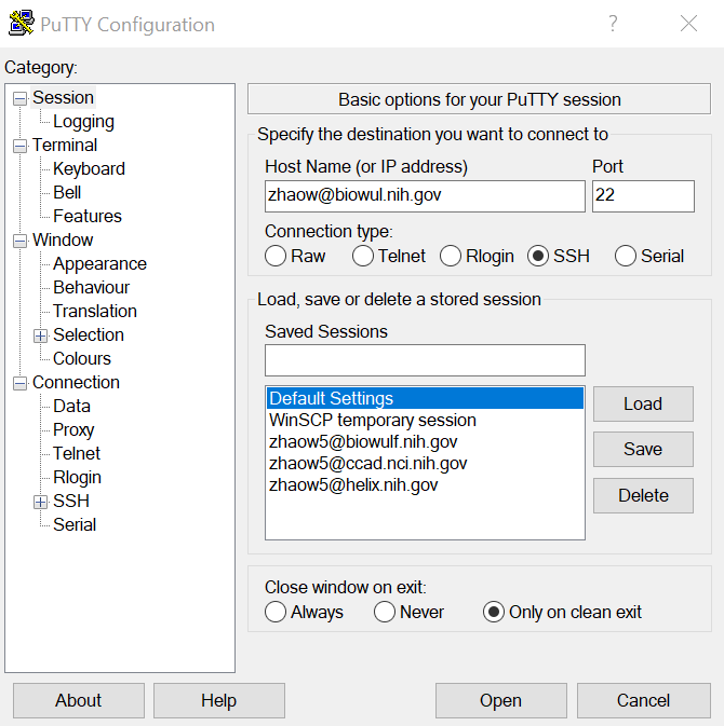

- At the prompt, enter the account password

At this point you should be connected to the NIH Biowulf cluster, and your screen
should look something like this:

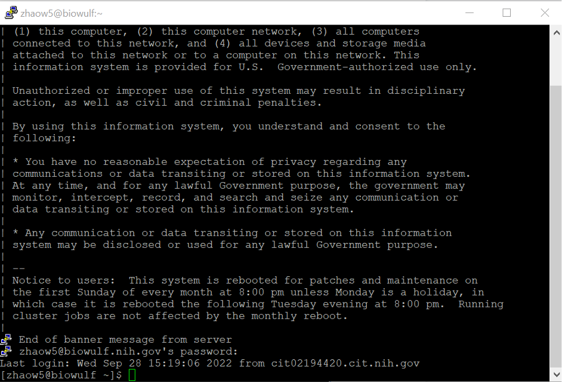

### Locally mounting HPC System Directories
We will need to mount your personal <code>/data</code> drive to access files on Biowulf from your local computer at the end of this session. See the instructions here for mounting your data directory: [https://hpc.nih.gov/docs/hpcdrive.html](https://hpc.nih.gov/docs/hpcdrive.html).

---

## Basic Bash/Linux commands

Before we begin coding, let's first open an interactive session. It's important to not run long commands on the login node as it will affect other users.

**Type this command:**

<code>sinteractive --mem=4g --cpus-per-task=4</code>

**and hit enter.**

You will see this screen when your request is being submitted and is waiting for resources:

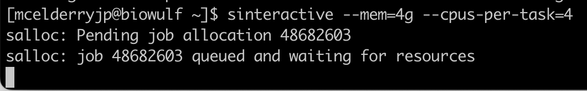

When you are allocated to a computing node and you should see USERNAME@cn#### like this:

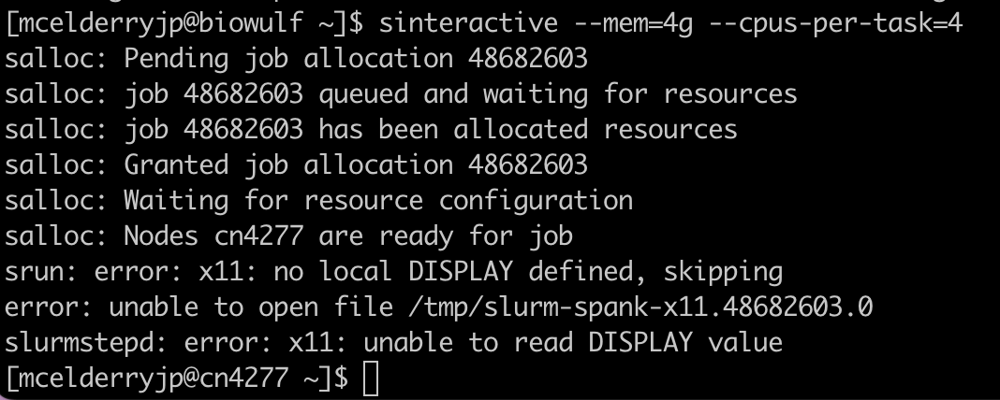

Now let's practice some basic linux commands:

**1\.** First, let's check what directory we're working in on the command line. Simply type:

<code>pwd</code>

and hit enter. This should output <code>/home/[your username]</code>.

**2\.** Since Biowulf home directories are relatively small we are going to be working in the /data/ directory, so let's make a folder there with the <code>mkdir</code> command:

<code>mkdir /data/[your username]/session1</code>

To verify that your folder was created successfully, enter the following: <code>ls /data/[your username]</code>. This should list all contents of your /data/ directory, and among those contents should be the 'session1' folder.

**3\.** Let's move ourselves to that directory to begin working:

<code>cd  /data/[your username]/session1</code>

Verify that you are in the right folder with the <code>pwd</code> command.

**4\.** Let's copy some files to practice with. We deposited two copies of our sample data in Biowulf and Github, respectively. You can follow either 4.a or 4.b to copy the data to your home directory.

**4\.a** Copy the data from the shared folder in Biowulf.
Before we do that, let's look at the contents of the course folder like so:

<code>ls -lh /data/classes/DCEG_Somatic_Workshop/Practical_session_1</code>

Now let's copy that data over to our current directory:

<code>cp -r /data/classes/DCEG_Somatic_Workshop/Practical_session_1/* .</code>

The option <code>-r</code> means copy directories recursively. If we omit this option, all the folders in this directory will be skipped.

The last two characters in the code above are special characters with specific meanings. The <code>*</code> in the code above is called a 'wildcard' and can be interpreted as 'anything'. So with this code we're copying all files in <code>/data/classes/DCEG_Somatic_Workshop/</code> matching the pattern 'anything', or in other words all files. The <code>.</code> in the code means 'the current working directory', and is where we're copying the files to.

**4\.b** Alternatively, you can download the data from GitHub.

Let’s first look up the link from GitHub. Open the website in web browser: **TODO:Add github link**

Click the green button ‘code’. Click the button next to the https link to copy the link.

**TODO:Add a screen shot here**

Then get back to the biowulf terminal to run the command:
<code>git clone **TODO:Add HTTPS link** .</code>

Now we can switch to the directory of sample input data.
<code>cd  sample_input_data</code>

<!--**5\.** For the sake of practice let's merge gencode.v19.og.bed and gencode.v19.tsg.bed into a single file gencode.v19.driver.bed:

<code>cat gencode.v19.og.bed gencode.v19.tsg.bed > gencode.v19.driver.bed
</code>

The <code>cat</code> command will print the contents of one or more files to your screen, but using the <code>></code> character we can redirect the output to a new file. To verify that we've pasted the files together, try using the <code>wc -l</code> command on <code>gencode.v19.og.bed</code>, <code>gencode.v19.tsg.bed</code>, and <code>gencode.v19.driver.bed</code> individually to count how many lines each one has.-->

**5\.** We're going to try sorting a file, so before we do that let's check the manual on the <code>sort</code> command:

<code>man sort</code>

Use the arrow keys or your scroll wheel to read, and take note of the options <code>-k</code> and <code>-r</code>. To exit the manual enter <code>:q</code>.

**6\.** Finally let's sort the bed file (gencode.hg38.chr22.bed) by genomic coordinates.

Before we sort it, we want to check the first few lines of the file:

<code>head gencode.hg38.chr22.bed</code>

By default, <code>head</code> will give you the first ten lines of a file to examine. If you want to see more, you can use the option <code>-n</code>, or use the <code>more</code> command.

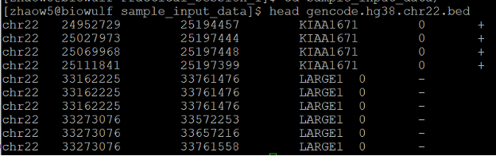

Then we can sort the file with this command:

<code>sort -k1,1 -k2,2n gencode.hg38.chr22.bed >gencode.hg38.chr22.sorted.bed</code>

<code>-k1,1 -k2,2n</code>: sort first by the first field, then by the second field numerically. The sorting isn't saved automatically, so as before we use the <code>></code> to redirect the output to a new file.

---

## Working with FASTQ files
**7\.** Before we can work with our fastq files we need to decompress them using the decompression command <code>tar</code>:

<code>tar -xzvf Sample1.tar.gz</code>

The <code>-xz</code> and <code>-f</code> options tell <code>tar</code> that we want to decompress our files and what file to extract from, respectively. The <code>-v</code> option is to print filenames as they're decompressed.

**8\.** Let's preview our files. We can do it in two ways:

<code>head Sample1_1.fq</code>

We have used the <code>head</code> command before. This will return the first ten lines of the file by default.

Alternatively, we can use:

<code>more Sample1_1.fq</code>

Use 'enter' or 'space' to scroll down, 'b' to scroll back, and '/' to search. To quit, either reach the end of the file or type <code>q</code>.

We have another compressed format for the same file (files with extension .fastq.gz). We can check the contents of these files directly without creating a plain text file, using this command:
<code>zless Sample1_1.fastq.gz</code>
Same to the command <code>more</code>, use ‘space’ to scroll down, and type <code>q</code> to exit.

To check the number of paired-end reads, use the following commands:

<code>echo $(zcat Sample1_1.fastq.gz | wc -l)/4 | bc</code>

<code>echo $(zcat Sample1_2.fastq.gz | wc -l)/4 | bc</code>

You should see '300,000’ for both commands.

To briefly explain these commands:

- <code>zcat Sample1_1.fastq.gz | wc -l</code>: print the decompressed contents of the gzipped (‘.gz’) reads file using ‘zcat’, then count the number of lines by feeding (or piping, the ‘\|’ symbol) the output directly to ‘wc -l’
- <code>echo $(...)/4 | bc</code>: setup a division by 4 of the line count value from the <code>wc -l</code> command using <code>echo</code> (recall that each sequence in the fastq is composed of four lines). This mathematical expression is only evaluated after using the command <code>bc</code>.

**9\.** Let's subset our fastq file to a smaller collection of reads with the seqtk library. First load seqtk:

<code>module load seqtk</code>

**10\.** then use the 'subseq' tool to extract the reads specified in the 'name.lst' file:

<code>seqtk subseq Sample1_1.fq name.lst >out.fq</code>

‘name.lst’ is a list of identifiers of reads.

<code> head name.lst</code>

Check the output file 'out.fq' with the <code>head</code> and/or <code>more</code> command.

---

## Working with BAM files

**11\.** We're going to be working with BAM files from 1000 genomes. The example data was downloaded from the [1000 Genomes Project](https://www.internationalgenome.org/home).

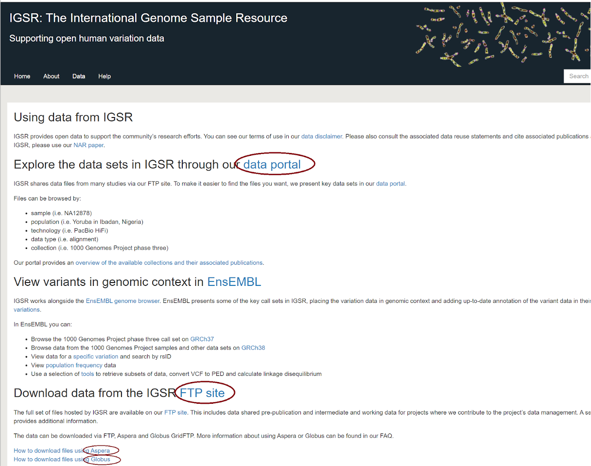

**12\.** Now we rename the BAM file in our input data folder to reads.bam.

<code>mv HG00118__chr22@38952741@38992778.bam reads.bam</code>

---

### Examine file format

**13\.** Let's look at the header of this BAM file. Try listing all the versions of samtools available on Biowulf:

<code>module spider samtools</code>

For our purposes any recent version will suffice, so enter <code>module load samtools</code> to load the default version of samtools. Then to view the BAM header, enter:

<code>samtools view -H reads.bam | more</code>

The <code>view</code> mode of samtools is a tool to print sections of a BAM/SAM/CRAM file, and the <code>-H</code> option instructs samtools to print only the header. In this example we then feed the samtools output directly to the <code>more</code> command via the linux 'pipe' (the <code>|</code> symbol) so it's easier to read and browse.

Note that we've been using a BAM file which is in binary format, but the output is in readable text. Samtools has converted the output from BAM to SAM automatically.

**14\.** Now let's view the first 20 lines of the aligned reads in the body section. The command will be very similar, but without the <code>-H</code> option samtools will ignore the header:

<code>samtools view reads.bam|head -20</code>

As before, we use the pipe to feed the output into the <code>head -20</code> command so we can see just the first 20 lines.

---

### Extract, sort, index reads

**15\.** Let's isolate only unmapped reads, and reads with unmapped mates:

<code>samtools view -b -f4 reads.bam >unmapped.bam</code>

<code>samtools view -b -f8 reads.bam >mate_unmapped.bam</code>

The <code>-b</code> flag tells samtools to output in the compressed BAM format rather than SAM, and is very important when working with large alignment files. The <code>-f</code> flag requires all output reads to have the specified alignment flags, in this case flag '4' and flag '8'. These correspond to 'read unmapped' and 'mate unmapped', respectively.

A full list of SAM flags can be found at: [https://broadinstitute.github.io/picard/explain-flags.html](https://broadinstitute.github.io/picard/explain-flags.html)

**16\.** Sort the original file by genomic coordinates and output into file reads_sorted.bam:

<code>samtools sort -o reads_sorted.bam reads.bam</code>

Note that in the previous command we used <code>></code> to save a new file whereas in this case we've used <code>-o [file name]</code> to accomplish the same.

**17\.** Let's now index the sorted file. Indexing allows for more efficient lookup of reads and is required to run many bioinformatics algorithms:

<code>samtools index reads_sorted.bam</code>

This should create a new index file <code>reads_sorted.bam.bai</code>.

**18\.** Take a look at some of the alignment statistics using:

<code>samtools flagstat reads_sorted.bam</code>

**19\.** Find all reads mapping to chr22:38,700,000-39,300,000 and save to file chr22.bam:

<code>samtools view -h reads_sorted.bam chr22:38,700,000-39,300,000 > chr22.bam</code>

The <code>-h</code> option will retain the original header in our output file.

<!--**20\.** We can visualize the alignment at XXXX using tview:

<code>samtools tview XXXX</code>

Note that the program IGV is much more useful for this purpose with more features, but we will not cover it today.-->

---

## Working with BED files

**20.** Let's convert our chr2 BAM alignment file to BED format. First load bedtools and then use the 'bamtobed' mode:

<code>module load bedtools</code>

<code>bedtools bamtobed -i chr22.bam > reads.bed</code>

**21\.** For each gene that overlaps with alignments, report the base-pair overlap between the sequence alignment and genes. Here we can use the ‘reads.bed’ file to extract all the regions with alignments.

<code>bedtools intersect -a reads.bed -b gencode.hg38.chr22.sorted.bed >intersect_overlap.bed</code>

<code>-a</code> and <code>-b</code> specify our two BED file inputs.

**22\.** Report regions in genes that have no overlap with alignments (specified with <code>-v</code>):

<code>bedtools intersect -a gencode.hg38.chr22.sorted.bed -b reads.bed -v  >intersect_no_overlap.bed</code>

See the diagram below for the specifics on bedtools intersect.

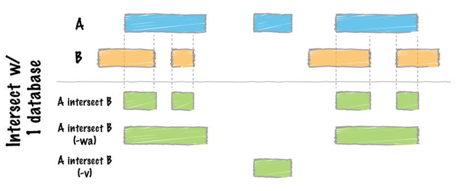

**23\.** For a more advanced query, we can do the following: report all reads within 2000bp upstream or 1000bp downstream of genes. Report each read with more than one hit only once by using <code>-u</code>:

<code>bedtools window -a reads.bed -b gencode.hg38.chr22.sorted.bed -l 2000 -r 1000 -u > intersect_reads_window.bed</code>

---

### Visualizing on UCSC

**24\.** We're going to visualize these reads on UCSC, and to do so we need to add some header lines to our BED file. Run the following series of commands (red text only):

- Configure browser:  <code>printf "browser position chr22:38,700,000-39,300,000\nbrowser hide all\n" > custom_UCSC_track.bed</code>

- Add the track for overlapping regions:  <code>(printf "track name=\"overlap regions\" description=\"example for bedtools A intersect B\" visibility=1 color=0,0,255 useScore=1\n#chrom\tchromStart\tchromEnd\tname\tscore\tstrand\n" && cat intersect_overlap.bed)  >> custom_UCSC_track.bed</code>

- Add the track for full length of genes:  <code>(printf "track name=\"original genes\" description=\"example for bedtools A intersect B -wa\" visibility=3 color=255,0,0 useScore=1\n#chrom\tchromStart\tchromEnd\tname\tscore\tstrand\n" && cat intersect_full_length_genes.bed)  >> custom_UCSC_track.bed</code>

These comments simply print some text and save them to a file. Take a look at this header using <code>head</code>.

Note one very important detail in the previous commands: <code>>></code> will append text to the end of an existing file while <code>></code> will overwrite existing files. **When working with files of your own, be very careful of this difference or you could accidentally lose data!**

**25\.** Let's now visualize using the UCSC genome browser. Go to [https://genome.ucsc.edu/](https://genome.ucsc.edu/). Under the "Genomes" tab, select "Human GRCh38/hg38" and then click the 'add custom tracks' button on the bottom of the genome browser.

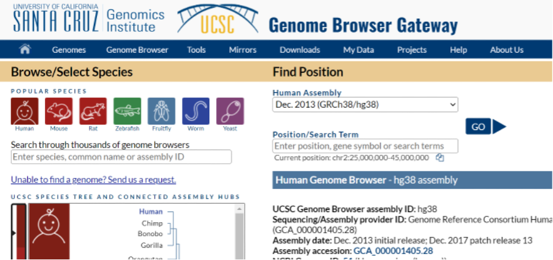

Next, upload the BED file via the "Choose File" button

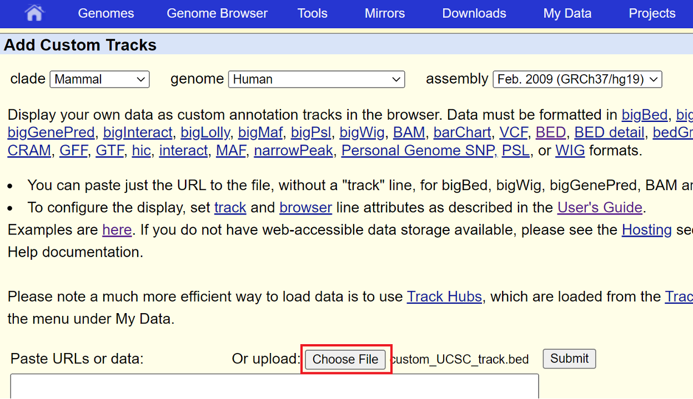

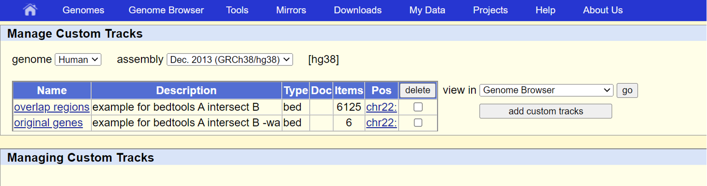

and finally hit "go". An APOBEC3 homozygous deletion is highlighted below.

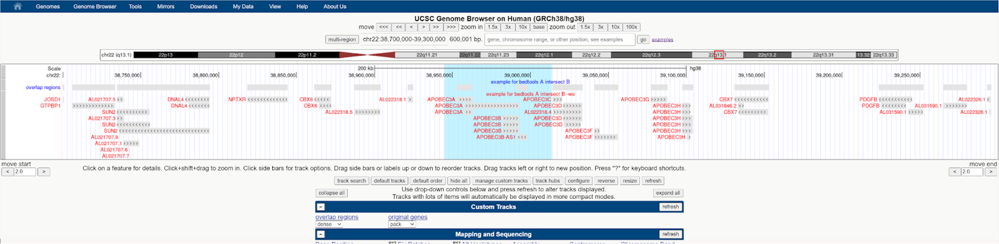
