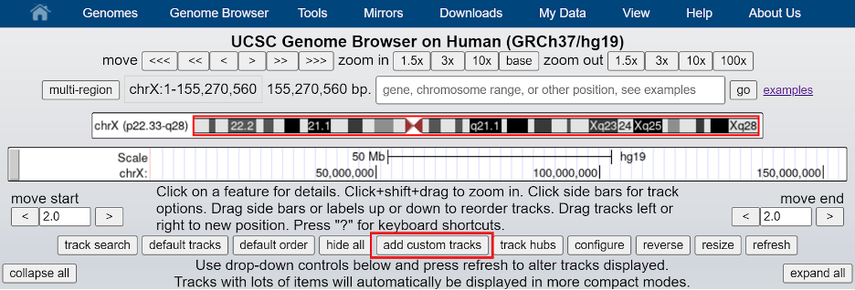
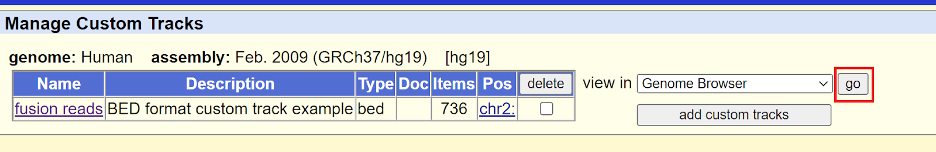

 

This practical section will focus first on connecting to a remote cluster
as well as using the linux command line. Then we will practice working with
some common bioinformatics file formats.

## Setup ssh connection

First, to use the computing clusters we need to establish an ssh connection
between your computer and the cluster. The steps to do this will differ
depending on whether you're using MacOS or Windows:

#### MacOS

- Open the Terminal app, like so:
	- "Finder -> Applications -> Utilities -> Terminal"
- enter the following command: <code>ssh username@helix.nih.gov</code>,
replacing 'username' with your own username.

#### Windows

- Install [PuTTY](https://www.chiark.greenend.org.uk/~sgtatham/putty/latest.html)
- Launch PuTTY. Under “Host Name (or IP address), type:
<code>username@helix.nih.gov</code>, replacing 'username' with your own username,
and click “Open”
- At the prompt, enter the account password

At this point you should be connected to the NIH Helix cluster, and your screen
should look something like this:

---

## Basic Bash/Linux commands

Let's practice some basic linux commands. :

**1\.** First, let's check what directory we're working in on the command line. Simply type:

<code>pwd</code>

and hit enter. This should output <code>/home/[your username]</code>.

**2\.** Since Biowulf home directories are relatively small we are going to be working in the /data/ directory, so let's make a folder there with the <code>mkdir</code> command:

<code>mkdir /data/[your username]/session1</code>

To verify that your folder was created successfully, enter the following: <code>ls /data/[your username]</code>. This should list all contents of your /data/ directory, and among those contents should be the 'session1' folder.

**3\.** Let's move ourselves to that directory to begin working:

<code>cd  /data/[your username]/session1</code>

Verify that you are in the right folder with the <code>pwd</code> command.

**4\.** Let's copy some files to practice with. Before we do that, let's look at the contents of the course folder like so:

<code>ls -lh /data/course</code>

Now let's copy that data over to our current directory:

<code>cp /data/course/* .</code>

The last two characters in the code above are special characters with specific meanings. The <code>*</code> in the code above is called a 'wildcard' and can be interpreted as 'everything', in this case meaning all files. The <code>.</code> in the code means 'current directory', and is where we're copying the files to.

**5\.** For the sake of practice let's merge gencode.v19.og.bed and gencode.v19.tsg.bed into a single file gencode.v19.driver.bed:

<code>cat gencode.v19.og.bed gencode.v19.tsg.bed > gencode.v19.driver.bed
</code>

The <code>cat</code> command will print the contents of one or more files to your screen, but using the <code>></code> character we can redirect the output to a new file. To verify that we've pasted the files together, try using the <code>wc -l</code> command on <code>gencode.v19.og.bed</code>, <code>gencode.v19.tsg.bed</code>, and <code>gencode.v19.driver.bed</code> individually to count how many lines each one has.

**6\.** We're going to try sorting our new file, so before we do that let's check the manual on the <code>sort</code> command:

<code>man sort</code>

Use the arrow keys or your scroll wheel to read, and take note of the options <code>-k</code> and <code>-r</code>. To exit the manual enter <code>:q</code>.

**7\.** Finally let's sort the merged bed file by genomic coordinates:

<code>sort -k1,1 -k2,2n gencode.v19.driver.bed > genelist.bed</code>

<code>-k1,1 -k2,2n</code>: sort first by the first field, then by the second field numerically. The sorting isn't saved automatically, so as before we use the <code>></code> to redirect the output to a new file.

---

## Working with FASTQ files
**8\.** Before we can work with our fastq files we need to decompress them:

<code>tar -xvf sample1.fq.tar.gz</code>

The <code>-x</code> and <code>-f</code> options tell tar to extract files and what file to extract from, respectively. The <code>-v</code> option is to print filenames as they're decompressed.

**9\.** Let's preview our files:

<code>head sample1.fq</code>

By default, head will you give you the first ten lines of a file to examine. If you want to see more, you can use the option <code>-n</code>, or use the <code>more</code> command:

more sample1.fq

Use 'enter' or 'space' to scroll down, 'b' to scroll back, and '/' to search. To quit, either reach the end of the file or type <code>:q</code>.

**10\.** Let's subset our fastq file to a smaller collection of reads with the seqtk library. First load seqtk:

<code>module load seqtk</code>

then use the 'subseq' tool to extract the reads specified in the 'name.lst' file:

seqtk subseq sample1.fq name.lst > out.fq

Check the output file 'out.fq' with the <code>head</code> and/or <code>more</code> command.

---

## Working with BAM files

**11\.** We're going to be working with BAM files from 1000 genomes. Download these files from the 1000 genomes FTP site like so:

<code>wget </code>

**12\.** Once that's finished downloading, rename this file to reads.bam.

<code>mv XXXX reads.bam</code>

**13\.** Let's look at the header of this BAM file. Before we begin working with this file using samtools we need to request an interactive session.

<code>sinteractive --mem=4g --cpus-per-task=2</code>

Once you are granted a session, try listing all the versions of samtools available on Biowulf:

<code>module spider samtools</code>

For our purposes any recent version will suffice, so enter <code>module load samtools</code> to load samtools. Then to view the BAM header, enter:

<code>samtools view -H reads.bam | more</code>

The <code>view</code> mode of samtools is a tool to print sections of a BAM/SAM/CRAM file, and the <code>-H</code> option instructs samtools to print only the header. In this example we then feed the samtools output directly to the <code>more</code> command via the linux 'pipe' (the <code>|<\code> symbol) so it's easier to read and browse.

Note that we've been using a BAM file which is in binary format, but the output is in readable text. Samtools has converted the output from BAM to SAM automatically.

**14\.** Now let's view the first 20 lines of the aligned reads in the body section. The command will be very similar, but without the <code>-H</code> option samtools will ignore the header by default:

<code>samtools view reads.bam|head -20</code>

As before, we use the pipe to feed the output into the <code>head -20</code> command so we can see just the first 20 lines.

**15\.** Let's isolate only the reads whose mate is unmapped:

<code>samtools view -b -f8 reads.bam >mate_unmapped.bam</code>

The <code>-b</code> flag tells samtools to output in BAM format rather than SAM, and the <code>-f</code> flag requires all output reads to have the specified alignment flags, in this case flag '8' which corresponds to 'mate unmapped'.

**16\.** Sort the original file by genomic coordinates and output into file reads_sorted.bam:

<code>samtools sort -o reads_sorted.bam reads.bam</code>

Note that in the previous command we used <code>></code> to save a new file whereas in this case we've used <code>-o filename</code> to accomplish the same.

**17\.** Let's now index the sorted file. Indexing allows for more efficient lookup of reads and is required for many bioinformatics algorithms:

<code>samtools index reads_sorted.bam</code>

This should create a new index file <code>reads_sorted.bam.bai/code>.

**18\.** Take a look at some of the alignment statistics using:

<code>samtools flagstat reads_sorted.bam</code>

**19\.** Find all reads mapping to chr2:25,000,000-45,000,000 and save to file chr2.bam:

<code>samtools view -h reads_sorted.bam chr2:25,000,000-45,000,000 > chr2.bam</code>

The <code>-h</code> option will retain the original header in our output file.

**20\.** We can visualize the alignment at XXXX using tview:

<code>samtools tview XXXX</code>

Note that the program IGV is much more useful for this purpose with more features, but we will not cover it today.

---

## Working with BED files

**21\.** Let's convert our chr2 BAM alignment file to BED format. First load bedtools and then use the 'bamtobed' mode:

<code>module load bedtools

bedtools bamtobed -i chr2.bam > reads.bed
</code>

**22\.** Report base-pair overlap between sequence alignment and genes

<code>bedtools intersect -a reads.bed -b gencode.v19.driver.bed >intersect_overlap.bed</code>

or to get the full read length rather than just the overlapping portions:

<code>bedtools intersect -a reads.bed -b gencode.v19.driver.bed -wa >intersect_full_length_reads.bed</code>

See the diagram below for the specifics on bedtools intersect.

**23\.** For a more advanced query, we can do the following: report all fusion reads within 2000bp upstream or 1000bp downstream of genes. Report each read with more than one hit only once:

<code>bedtools window -a reads.bed -b gencode.v19.driver.bed -l 2000 -r 1000 -u  >fusion_reads_window.bed</code>

**24\.** We're going to visualize these reads on UCSC, and to do so we need to add some header lines to our BED file. Copy and paste the following command:

<code>(printf "browser position chr2:25,000,000-45,000,000\nbrowser hide all\ntrack name=\"fusion reads\" description=\"BED format custom track example\" visibility=1 color=70,130,180 useScore=1\n#chrom\tchrom\tStart\tchromEnd\tname\tscore\tstrand\n" && cat fusion_reads_window.bed) > custom_UCSC_track.bed<\code>

. This will paste the header (everything within the quotes) and our BED file together into one file.

**25\.** Let's now visualize using the UCSC genome browser. Go to https://genome.ucsc.edu/ . Under the "Genomes" tab, select "Human GRCh37/hg19" and then click the 'add custom tracks' button on the bottom of the genome browser.

Next, upload the BED file via the "Choose File" button

and finally hit "go".

