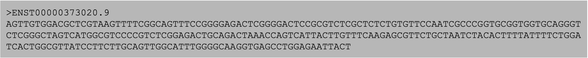
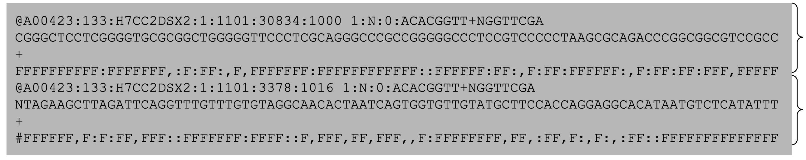
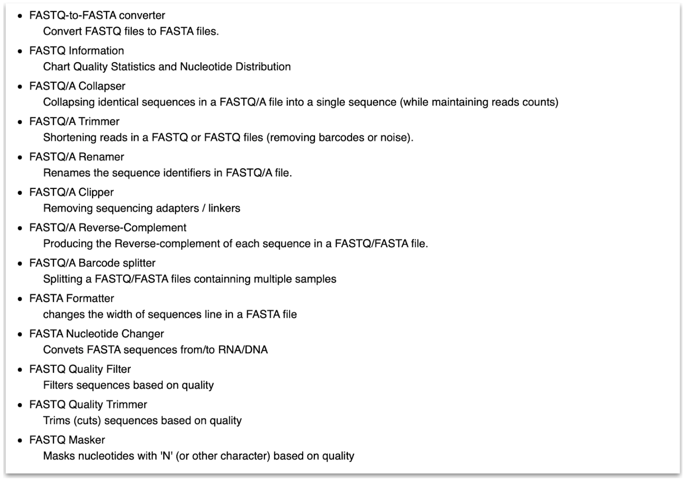
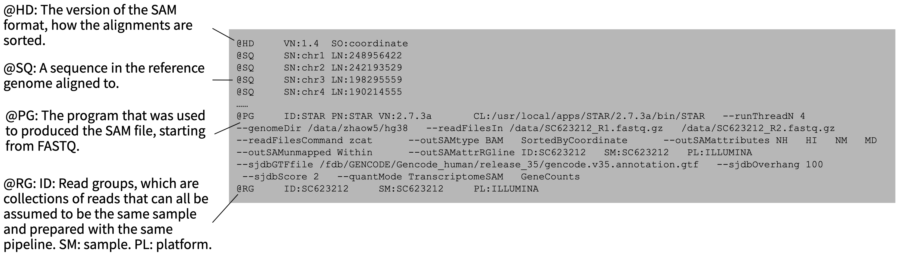
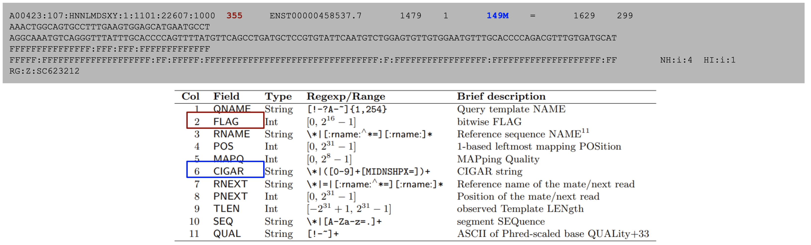
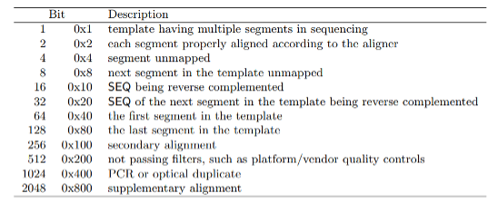
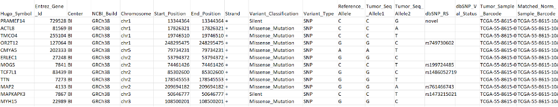
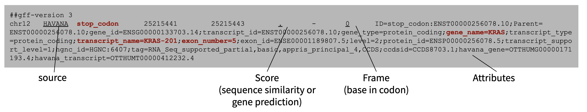

## FASTA

FASTA (‘fast-a’) format is a simple format for storing sequences of nucleotides or amino acids. FASTA files are usually used only to contain reference sequences as they lack important information that would be relevant for sequencing reads, such as quality scores. Files in FASTA format traditionally end in “.fasta”, “.fa”, or “.fsa”.

FASTA files may contain one or many individual sequences, each of which is prefixed with a definition line (or “defline”) beginning with “>”. This line contains the sequence name and sometimes other important annotations for the sequence.

Generally speaking since FASTA files are often only reference sequences there’s not much analysis work to be done with them directly. That said, for some handy FASTA tools see [this list](https://www.ncbi.nlm.nih.gov/CBBresearch/Spouge/html_ncbi/html/fasta/list.html).

---

## FASTQ

For sequence information from sequencing experiments, nucleotide sequences must be stored with per-base sequence quality scores. This is the purpose of the FASTQ (“fast-q”) file format. FASTQ files are traditionally suffixed with “.fastq”, “.fq”, and “.fq.gz” when compressed using the gzip algorithm.

The above FASTQ snippet contains two paired reads, each with four lines of information.

- Line 1: an identifier line containing metadata from the sequencer for the sequence, starting with '@':

- Line 2: the nucleotide sequence of the read
- Line 3: a ‘+’ sign, sometimes followed by the sequence identifier as in line 1
- Line 4: per-base Phred quality scores, encoded using ASCII

The quality scores are a transformation of the probability that a base was called incorrectly, according to the equation Q= -10log10(P). Thus every one point decrease in the quality score reflects a tenfold increase in the probability of an incorrectly sequenced base. To reduce file lengths this quality score is then transformed to a single character under the ASCII-based Phred-33 system. For instance, “F” in the quality scores above equates to 37 in Phred-33 meaning there is a 10-37 probability of any base with quality score “F” being called incorrectly. For more information on quality scores, check [here](https://support.illumina.com/help/BaseSpace_OLH_009008/Content/Source/Informatics/BS/QualityScoreEncoding_swBS.htm).

Two comprehensive packages for working with FASTQ, and also FASTA, include [seqtk](https://docs.csc.fi/apps/seqtk/) and the [FASTX Toolkit](http://hannonlab.cshl.edu/fastx_toolkit/index.html).

<!--

  

    
  

  

    
  

*Summary of the functions available in seqtk (left) and FASTX toolkit (above)*
-->
---

## SAM (Sequence Alignment Map), BAM, CRAM

SAM, BAM, and CRAM are three formats used to store aligned sequences. The three formats store the same information but most importantly vary in their level of compression. SAM files are uncompressed and are human-readable without the use of additional software. BAM files are SAM files transformed into binary format for compression. CRAM files use a different compression algorithm from BAM and achieve the highest degree of compression. Notably the CRAM format stores only the bases that differ from the aligned reference genome, and therefore to work with CRAM files the reference genome is generally required. These alignment formats are suffixed simply with “.sam”,“.bam”, and ”.cram”.

Alignment files are composed of two sections: a header section and a list of aligned sequences. The header contains annotation information such as file formatting information, reference sequence information, the aligner and other software used to produce the alignment file, and read group information which can be used to trace which sample or sequencing run a sequence came from.

The sequences themselves are stored in a format composed of eleven sections with important information such as read name, alignment flags, which reference the sequence is aligned to, where it’s aligned, how well it’s aligned, and information on its paired mate read.

*from the [samtools documentation](https://samtools.github.io/hts-specs/SAMv1.pdf)*

### Alignment Flags

The FLAG element is an additive combination of integers representing alignment status flags.

*from the [samtools documentation](https://samtools.github.io/hts-specs/SAMv1.pdf)*

As an example, the 355 flag represents the sum of the integers 1+2+32+64+256=355, and indicates that this read is paired (1), both reads in the pair are mapped properly (2), the mate is on the reverse strand (32), this is the first read in the pair (64), and that this read is not the primary alignment of this sequence (256). An excellent resource for decomposing an alignment flag into its components can be found [here](https://broadinstitute.github.io/picard/explain-flags.html). Alignment flags allow for filtering reads based on their alignment quality, such as selecting reads with both pairs mapped (flag 3) or filtering out unmapped reads and supplementary alignments (flags 4,8, and 256).

The CIGAR string represents the alignment status of the sequence against the reference. It is represented by a series of number-letter pairs indicating the number of base pairs and how those bases align against the reference.

*https://genome.sph.umich.edu/wiki/SAM#What_is_a_CIGAR.3F*

In the above example, the CIGAR string 3M1I3M1D5M indicates 3 matching bases, 1 inserted base, 3 matching bases, 1 deleted base, and 5 matching bases in that order. See below for a description of what each letter indicates.

*from the [samtools documentation](https://samtools.github.io/hts-specs/SAMv1.pdf)*

Two very popular tools for working with alignment files are Samtools and Picard. Both are compatible with SAM, BAM, and CRAM formats, and provide functions to read, write, view, edit, filter, and index alignment files, plus more. For a full description of the functionality of each, see the [Samtools](http://www.htslib.org/doc/samtools.html) and [Picard](https://broadinstitute.github.io/picard/) documentation.

---

## VCF (Variant Calling Format)/BCF

The VCF format stores information about genetic variants (SNVs, indels, SVs). Like BAM format is to SAM, BCF is the compressed, binary version of VCF. VCF and BCF file names end with ".vcf" and ".bcf", respectively. Also like SAM files, VCF files are composed of a header with meta-information and a body containing the data.

The header lines (in black) always begin with “##” and describe important metadata for the file, such as the software which generated the VCF file, the reference genome, and many lines defining terms within the INFO, FILTER, and FORMAT fields. Within the body of the VCF file there are eight mandatory VCF fields (in red) followed by some number of genotype fields (in blue). The mandatory fields indicate basic facts about the variant:

-	CHROM: chromosome/genome scaffold
-	POS: starting coordinate of the variant
-	ID: variant ID, if any
-	REF: the reference allele
-	ALT: the variant allele
-	QUAL: a Phred scaled quality score indicating probability of a true variant
-	FILTER: a list of filters applicable to the variant, separated by semicolons. All filter values are defined in the header. ‘PASS’ or ‘.’ indicates no filtering issues.
-	INFO: a list of annotations separated by semicolons in ‘key=value’ format. The meaning for each key is defined in the header.

. The genotype fields contain sample-by-sample information for each variant, such as genotype and allele frequency, separated by colons. The FORMAT field defines the format by which information is stored in the genotype fields. This column is followed by a column for every sample analyzed during variant calling.

BCFtools is a popular program for reading and writing VCF and BCF files as well as calling, filtering, and summarizing variants. Find the documentation for BCFtools [here](http://samtools.github.io/bcftools/).

---

## MAF (Mutation Annotation Format)

MAF is a higher-level representation of variants. As compared to VCF which usually contains data on the sample level, MAF aggregates mutations from many or all samples within an experiment. MAF also includes more annotation information from public databases, such as the associated genes for variants, genome build, functional consequences, etc.

Maftools is a useful tool for working with MAF files. Maftools provides lots of high-level functionality such as driver gene analysis, survival curves, mutation enrichment analysis, etc., and it also provides functions for generating publication-quality plots. See [here](https://bioconductor.org/packages/release/bioc/vignettes/maftools/inst/doc/maftools.html) for more on Maftools.

---

## BED

BED files are used to store genomic interval information, such as the coordinates for a gene within a reference genome. BED files end with the suffix “.bed”.

BED files have three required fields describing the genomic coordinates for a feature (chromosome, start, stop), followed by six optional fields for storing annotations and display customizations which are used when displaying on genome browsers.

One key detail to pay attention to is the start and stop coordinates which can be formatted one of two ways: 0-based or 1-based indexing. 0-based BED files number the gaps between bases whereas 1-based indexing numbers the bases themselves. For instance, a 0-based indexed BED file covering the first 10 bases of a genome would read start=0, stop=10 whereas a 1-based BED would read start=1, stop=10.

This is important to note as a 1-based BED file interpreted as a 0-based BED will cover an incorrect interval and vice-versa. To quickly check which format your BED is in, the 'stop' minus the 'start' position of a 0-based BED is equal to the length of the fragment, whereas in a 1-based BED it’s equal to the length-1.

Bedtools is a popular resource for working with BED files, and is generally used for intersecting, merging, subtracting, filtering, and other miscellaneous operations with BED files. See the documents for bedtools [here](https://bedtools.readthedocs.io/en/latest/).

---

## GTF/GFF

Like BED, GTF and GFF store data on genomic intervals. GTF is identical to GFF version 2, and only different from GFF version 3 in the formatting of their attributes field. Typically GTF is used to store gene and transcript coordinates whereas GFF is a more general purpose designation. These files are suffixed with ‘.gtf‘, ‘.gff’, ‘.gff2’, or ‘.gff3’.
The format is as follows:

1. Chromosome
2. Source of the GFF/GTF file
3. Name for record/interval
4. Start coordinate (1-based)
5. Stop coordinate
6. A score value, frequently ‘.’ which indicates 'null'
7. Genomic strand
8. Frame (1, 2, or 3)
9. Attributes - annotations for the interval

Working with GTF or GFF files can be done with GffCompare. GffCompare provides a set of tools for merging, comparing, estimating transcript accuracy, etc. for GTF and GFF files. Find the documentation [here](http://ccb.jhu.edu/software/stringtie/gffcompare.shtml).

---

## Additional Resources

For full descriptions of aforementioned formats as well as tools to work with them, see the resources below as well as the supplementary information tab for this session.

- [UConn file formats guide ](https://bioinformatics.uconn.edu/resources-and-events/tutorials-2/file-formats-tutorial/)
- [Explain SAM/BAM Alignment Flags](https://broadinstitute.github.io/picard/explain-flags.html)
- [CIGAR string formatting](https://genome.sph.umich.edu/wiki/SAM#What_is_a_CIGAR.3F)
- [Samtools docs on file formats](https://samtools.github.io/hts-specs/)
- [UCSC file format descriptions](https://genome.ucsc.edu/FAQ/FAQformat.html)
