 

## Investigation of tumor mutational burden (TMB)
#### Which cancer type has the highest TMB? Which cancer type has the lowest TMB?

We can use the ICGC Data Portal to investigate TMB.

- Go to the ICGC Data Portal website: <a href="https://dcc.icgc.org/" target="_blank">https://dcc.icgc.org/</a>.
- Select the **Cancer Projects** tab at the top left of the page.

- At the bottom of the **Cancer Projects** page, you will see a plot, titled **Number of Somatic Mutations in Donor Exomes Across Cancer Projects**, with cancer types along the x-axis and the number of mutations per Mb along the y-axis (highlighted by a red box below).  In the plot, the red line across each cancer type is the median number of mutations per Mb. This value increases as you move across the plot from left to right.

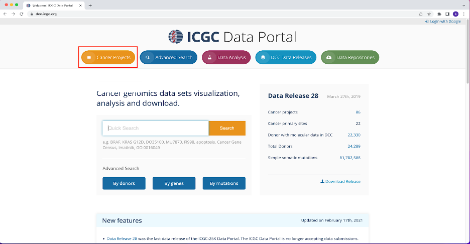

If you hover over the plot, you will see information for each cancer type, including median number of mutations per Mb, number of donors, and total number of mutations.

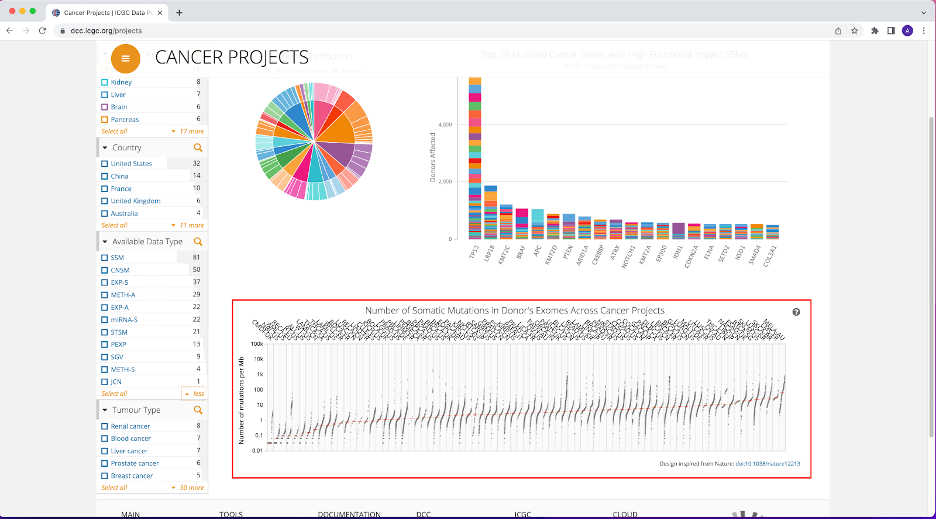

**Melanoma has the highest TMB, with a median of 68.1 mutations per Mb**

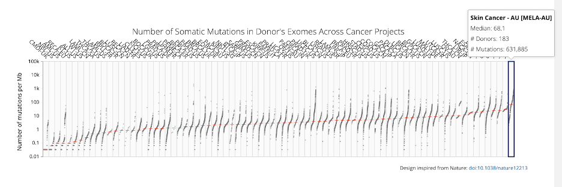

**and Chronic Myeloid Disorders-UK has the lowest TMB, with a median of 0.033 mutations per Mb.**

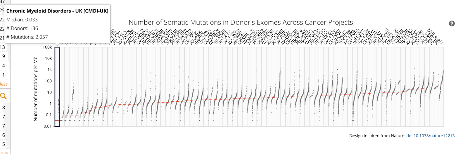

---

#### How can we compare and visualize TMB from my study to a public data set (e.g TCGA WES)?

The R package TCGAmutations provides pre-compiled, curated somatic mutations from 33 TCGA cohorts along with relevant clinical information for all sequenced samples. Somatic mutations from both the **MC3** and **Firehose** pipelines are included. You can load these mutation data as well as your TMB data into the tcgaCompare function from MAFtools R package for comparison and visualization, which will generate plot similar to the one below:

---

## Gene-specific mutation frequencies in different cancer types

#### How can I look at the mutation frequency of specific genes in different cancer types using the ICGC Data Portal?

There are two methods of doing this using the ICGC Data Portal, one by project name, and the other by primary site. We demonstrate both of these methods below.

First, make sure you are still on the ICGC Data Portal website: <a href="https://dcc.icgc.org/" target="_blank">https://dcc.icgc.org/</a>.

**Method One: Using the ICGC Portal to Investigate By Project Name**

- Our first example will be by searching for a specific study. Using the **Cancer Projects** page on the ICGC Data Portal, enter the project name, **SKCM-US**, into the **Project text box**.
- Three different plots will load. The pie chart is of the donor distribution. The bottom plot is the same plot from question one, but now with the project, **SKCM-US**, highlighted. The bar plot on the right shows the **Top 20 Mutated Cancer Genes** in the **SKCM-US** project. By hovering over the plot, we can see how many donors were affected by each gene mutation. **The most mutated cancer gene was BRAF, with 238 of 466 donors affected.**

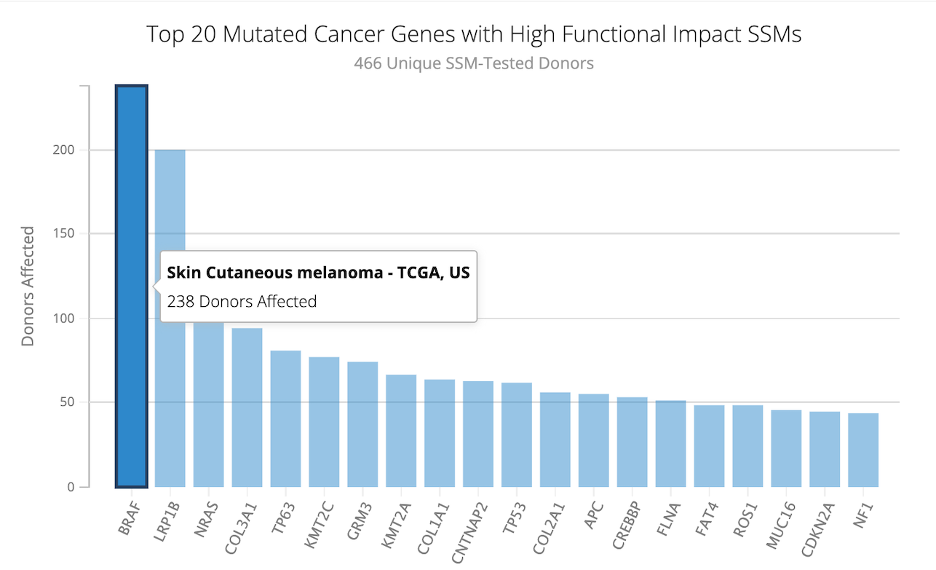

**Method Two: Using the ICGC Portal to Investigate Mutation Frequency By Primary Site**

- We can also look at mutation frequency in genes for a given cancer type by searching by primary site. After clearing the previous search using the **Reset** button on the **Cancer Projects** page, select Lung from the list under Primary Site. There will be four studies loaded: **LUAD-CN, LUAD-US, LUSC-US, and LUSC-KR**.
- In the bar plot of the **Top 20 Mutated Cancer Genes**, the **most mutated gene across these four studies was TP53, with over six hundred donors affected**. If you hover over the bar for **TP53**, you will see that it is split by study. For example:

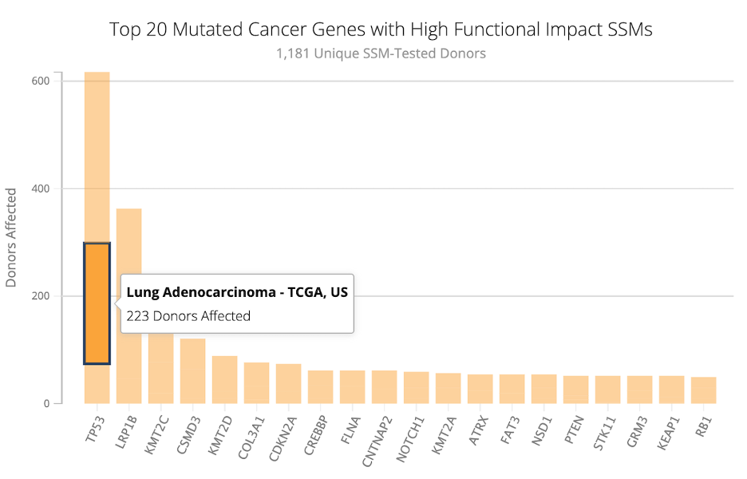

Note: You can also search studies by country. On the left panel, select a country or countries. The plots will update based on the selected options.

---

#### How can we check similar mutation frequency in TCGA or other cohorts?

There are multiple ways to do this. The most common one is to search in cBioPortal. We demonstrate an example of this below using the LUAD TCGA study.

- Go to the cBioPortal website: <a href="https://www.cbioportal.org/" target="_blank">https://www.cbioportal.org/</a>.
- At the top left of the page, click on the **Data Sets** tab <a href="https://www.cbioportal.org/datasets" target="_blank">https://www.cbioportal.org/datasets</a>.

- You will see a list of all of the datasets available in cBioPortal.  At the top left of the page you will see a search bar. Input the keyword **TCGA, PanCancer Atlas**. The page will automatically update with all of the studies from the TCGA, PanCancer Atlas studies. Using the **Name** column, click on the **Lung Adenocarcinoma (TCGA, PanCancer Atlas)** study (about halfway down the page).

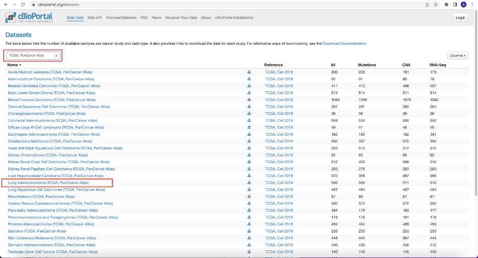

- When you click the LUAD study name, a new page will appear with a summary of the study.
- On the left side of the page, the second chart, **Mutated Genes**, contains a summary of the genomic landscape profile, including the most frequently mutated genes in the selected cohort (LUAD, TCGA PanCancer Atlas). You can make this box larger by using the arrow at the bottom corner of the box.

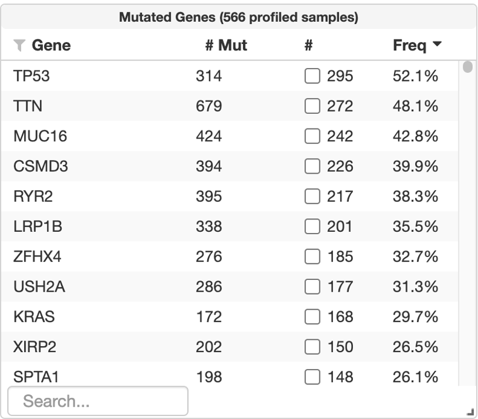

---

## Cancer driver gene frequencies

#### How do we explore cancer driver gene frequency in PanCancer and in specific cancer types?

We will explore driver gene frequency in PanCancer and specific cancer types using the IntOGen resource. See below for a demonstration for both PanCancer and specific cancer type approaches.

**Approach One: Driver Gene Frequency- PanCancer**

- Go to the Integrative Onco Genomics (IntOGen) website: <a href="https://www.intogen.org/search" target="_blank">https://www.intogen.org/search</a>.
- On the home page, we see a pie chart containing IntOGen Samples. On the second tab, Table, we can view the sample data in a table format, with information about the cancer type, cohort, age, tumor type, cancer drivers, number of samples, and number of mutations.

**Pie Chart of IntOGen Samples**
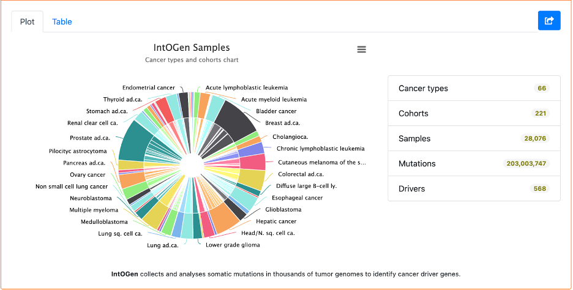

**Table of IntOGen Sample Information**
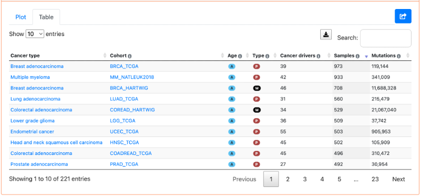

- At the bottom of the page is a set of figures highlighting the mutational cancer driver genes. The **Cloud** tab contains a word cloud of the gene names, with larger font size denoting a larger number of mutations of that gene. We can also see a bar plot of these frequencies in the **Plot** tab. The **Table** tab shows this information in table format, including the gene symbol, number of mutations, number of samples, the percentage of samples with the mutation, and cohorts.

**From this exploration, we can see that IntOGen has over 28,000 samples and includes 568 cancer drivers. We can also see that TP53 and KRAS are the most frequently mutated driver genes when considering all samples in IntOGen.**

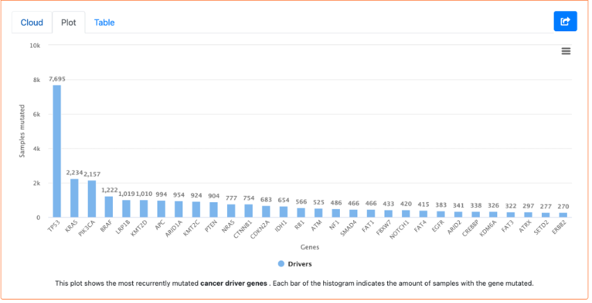

**Approach Two: Driver Gene Frequency- Specific Cancer Type: LUAD TCGA**

- In the search bar of the IntOGen website, search **LUAD_TCGA**.  This will take you to a page with cohort details, as well as the same three plots for mutational cancer driver genes that were available when exploring all of the IntOGen samples, but now specific to LUAD TCGA.

**If we look at the bar plot, we can see that TP53 and KRAS are the most frequently mutated cancer driver genes in the LUAD TCGA cohort.**

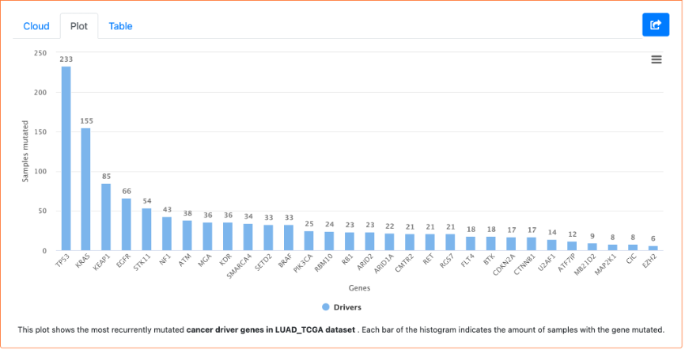

---

#### My candidate genes are not included or not identified as driver genes in the IntOGen database (e.g. NUDT11 in LUAD). Is there any way to check if these genes are identified as potential driver genes by another method?

You can check if these genes are identified as a potential driver using another method. We will use the Firebrowse website as an alternative to IntOGen for checking for potential cancer driver genes.

- Go to the FireBrowse website: <a href="http://firebrowse.org/#" target="_blank">http://firebrowse.org/#</a>.
- Using the **Select Cohort** dropdown on the left side of the page, and select the **Lung Adenocarcinoma (LUAD)** cohort.

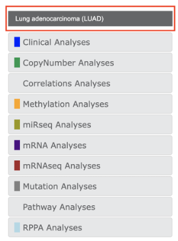

- Then, select **Mutation Analyses**. Under this menu, select **MutSig2CV**. This will open a report of the analysis. Click **Open in New Window** to make the report larger.
- Select the **Significantly Mutated Genes** section in the first part of the report. This will open a table of significantly mutated genes in this analysis for LUAD. If you scroll down in the table, you will find your candidate gene of interest, *NUDT11*.

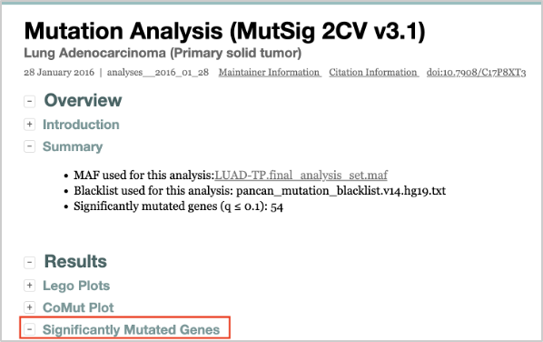

**Among the gene list, you will see NUDT11 is identified as a potential driver gene with a  statistically significant p-value of 0.000034 and q-value of 0.02.**

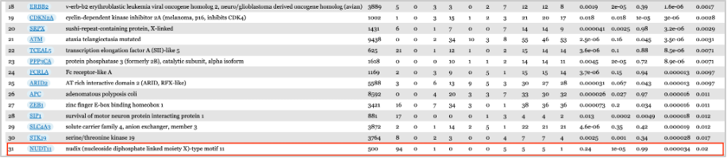

---

## Somatic alterations in multiple genes from the same cohort.

#### How can we use cBioPortal for exploring somatic alterations in multiple genes from the same cohort?

See the steps below to use cBioPortal for exploring somatic alterations in multiple genes from the same cohort.

- Return to the cBioPortal website: <a href="https://www.cbioportal.org/" target="_blank">https://www.cbioportal.org/</a>.
- In the search box at the top right of the **Query** tab, search for **skin**. Find and select the study under **Melanoma** that is **Skin Cutaneous Melanoma (TCGA, PanCancer Atlas)**.
- After selecting this study, click the **Query by Gene** button at the bottom of the page.
- On the query page, make sure that the first three boxes under **Select Genomic Profiles** are checked: **Mutations, Structural Variant, and Putative copy-number alterations from GISTIC.** Then, under the section **Enter Genes**, enter these three gene names: **BRAF, NRAS, NF1**. You can enter these on separate lines or in a comma-separated list. Before clicking **Submit Query** at the bottom left of the page, make sure your query looks like the following, and then submit the query.

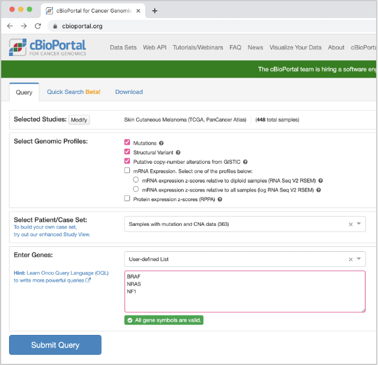

- In the results for the query, you will see several tabs across the top of the page. **OncoPrint** illustrates the percentage of samples with mutations in the queried genes, and how they pair up to other gene mutations (those included in the query). From **OncoPrint**, we can see at first glance that these genes have some sort of mutual exclusivity. This is quantified on the **Mutual Exclusivity** tab. **Based on significant p-values, BRAF exhibits mutual exclusivity from NRAS and NF1, and vice versa.**

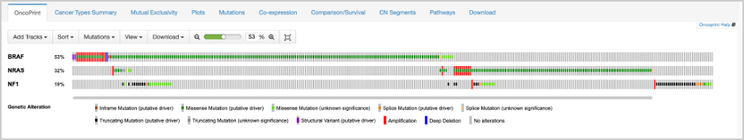 
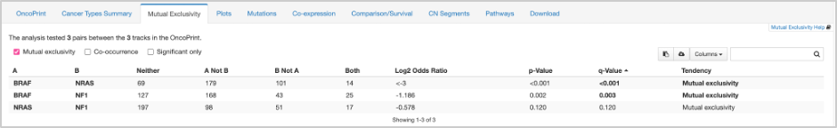

- On the **Mutations** tab, there is a plot at the top with the mutations in a given gene (highlighted at the top left). Along the x-axis is the amino acid number, and on the y-axis is the number of mutations in the selected gene. For **BRAF**, you will see a lollipop plot with the different mutations in the gene. If you click one of the lollipops in the plot, it will highlight those mutations in the table beneath the plot.

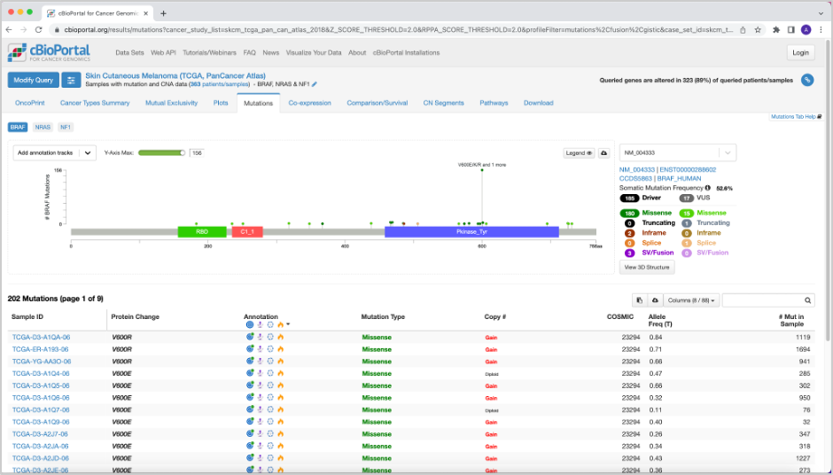

- On the **Plots** tab, we can generate a plot to look at the relationship between copy number variations and mRNA expression. Using the input boxes on the left, make sure your input looks like the following, with **copy number variations on the x-axis and mRNA expression (RSEM) on the y-axis:**

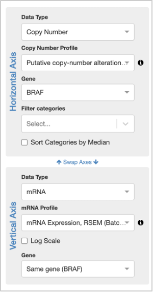

- The output plot should look like the following (in this example BRAF was used, but you can choose a different gene from the original query if you’d like):

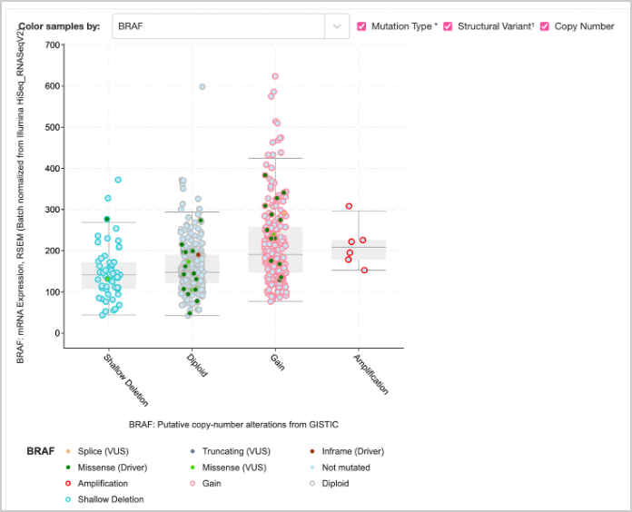

- Now if you go to the **Pathways** tab, you will see that different pathways are affected when these mutations in the queried genes are present. In this case the RTK-RAS pathway is the most affected pathway when considering BRAF, NRAS, or NF1 mutations.

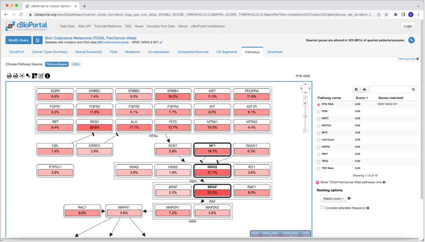

---

#### How can we perform a similar analysis but focus on specific genomic alterations (e.g hotspot mutations or deleterious mutations, or copy number amplification) for each gene? For example, in melanoma, the above mutational exclusive pattern is not significant between NF1 and NRAS, which seems unexpected in TCGA melanoma publication.

In cBioPortal, it is easy to query the gene with specific genomic alterations using the Onco Query Language (OQL): <a href="https://docs.cbioportal.org/user-guide/oql/" target="_blank">https://docs.cbioportal.org/user-guide/oql/</a>. See below.

- Click **Modify Query** at the top left of the page and include the OQL keywords after the gene name:
   BRAF: MUT = V600
   NRAS: MUT = Q61
   NF1: MUT != MISSENSE
- Now your query should look like the following:

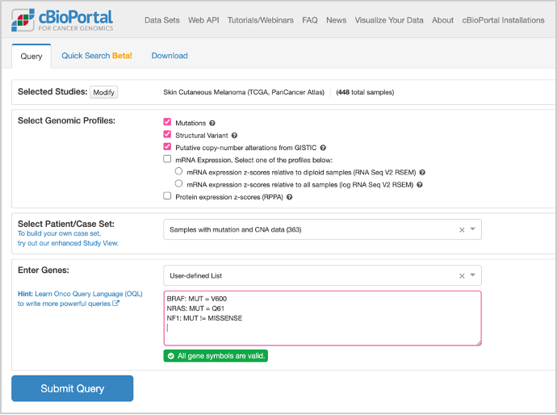

- After re-submitting the query, we can check the **Mutual Exclusivity** tab again.

**Now you will see a significant mutually exclusive pattern between NF1 and NRAS with a p-value = ​​0.003**

---

## Recurrent hotspot mutations and therapeutic implications

#### How can I use Cancer Hotspots to explore recurrent hotspot mutations and their therapeutic implications?

We can easily use Cancer Hotspots by searching for specific genes and filtering for certain variants. See the example below.

**Example hotspot mutation(s): EGFR V600E, KRAS G12.**

- In the cBioPortal **Mutations** tab from your previous query locate the **Cancer Hotspots** icon in the annotations column, or go directly to the Cancer Hotspots website: <a href="http://www.cancerhotspots.org/#/home" target="_blank">http://www.cancerhotspots.org/#/home</a>.
- **Cancer Hotspots** is a resource for statistically significant mutations in cancer.  The home page of the site contains a table with over a thousand gene mutations in cancer. You can **Show/Hide** columns on the table, hover over the variants column for a given gene to see the variant count breakdown, and search for a desired term found in the table.

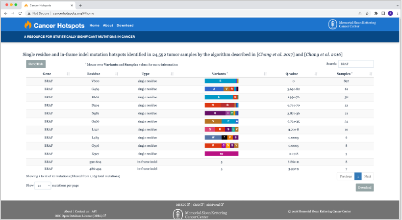

- Going back to the example from the previous question, we can search for **BRAF** in the table. We now have a filtered table of all of the BRAF mutations in Cancer Hotspots.
- If we hover over, for example, the BRAF Variants for mutation of **Residue V600**, we see the following variant count breakdown:

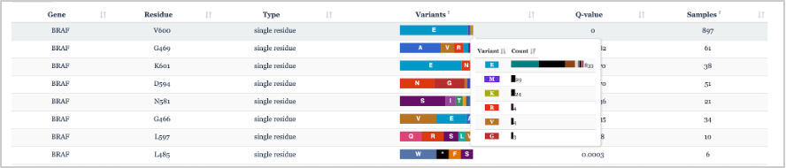

- Also under the annotations column in the **cBioPortal Mutations tab check the OncoKB icon or go to the OncoKB database for BRAF V600R** (<a href="https://www.oncokb.org/gene/BRAF/V600R" target="_blank">https://www.oncokb.org/gene/BRAF/V600R</a>). The OncoKB database is MSK's Precision Oncology Knowledge Base, and includes almost 700 genes, 6000 alterations, and over 100 cancer types. It is an FDA-recognized human genetic variant database. There is a mapping schema of the OncoKB levels of evidence and the FDA levels of evidence with regard to the therapeutic levels for cancer mutations:

- Using the OncoKB database, we can find detailed information for the **BRAF V600R** mutation (<a href="https://www.oncokb.org/gene/BRAF/V600R" target="_blank">https://www.oncokb.org/gene/BRAF/V600R</a>):

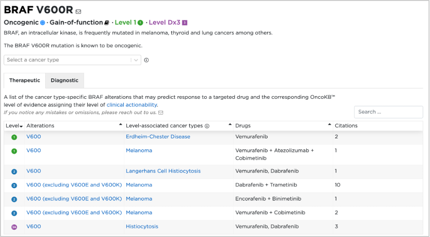

---

#### What about non-coding mutations? How can I check if non-coding mutations are potential drivers from my study?

We can use the Cornell Non-Coding Cancer Driver Database to check non-coding mutations, or the PeCan database from St. Jude. There are examples for each below.

**Method One: Check Mutations using the CNCDatabase**

- Go to the Cornell Non-Coding Cancer Driver Database, or CNCDatabase: <a href="https://cncdatabase.med.cornell.edu/" target="_blank">https://cncdatabase.med.cornell.edu/</a>.
- Click on the **Search** tab (located at the top of the page).
- In the **Gene name** search box, enter and select **TERT** from the dropdown list. Click **Submit**.
- This will load a **Summary** section and a Results section.

**In the summary section, you can see that TERT promoter mutations have been predicted as drivers in many cancer types through both gene expression association and experimental validations.**

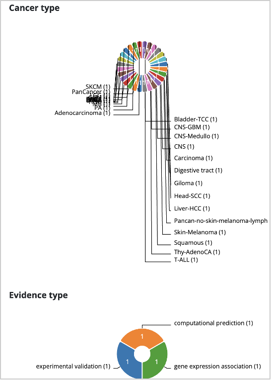

**Method Two: Check Mutations using the PeCan**

- Go to the St. Jude Cloud website, PeCan: <a href="https://pecan.stjude.cloud/" target="_blank">https://pecan.stjude.cloud/</a>. This contains information about several pediatric cancer studies and samples.
- This will take you to the home page. On the left side of the page is a pie chart with a sample breakdown for all samples and cancer types available in PeCan.
- From this page, **click on any gene on the right side** of the page to go to the hotspot information specific to that gene. In this example, we will use **TP53** (<a href="https://pecan.stjude.cloud/proteinpaint/TP53" target="_blank">https://pecan.stjude.cloud/proteinpaint/TP53</a>). When the page loads, you will see the TP53 gene with all of the amino acid residue variants across the gene. **Click on any of the variants for additional information.** You can also click on any other variants not already expanded at the bottom of the plot to expand them.

---

#### How can I use the ProteinPaint from St. Jude Cloud website to visualize my mutation data?

In our example, we will download mutation data and then upload it to ProteinPaint to visualize it.

- Download and Format Mutation Data

- Return to the cBioPortal website: <a href="https://www.cbioportal.org/" target="_blank">https://www.cbioportal.org/</a>.
- Use the **Quick Select** option in the top middle of the page to select **TCGA PanCancer Atlas Studies**. You should see at the top of the page that you have **32 studies collected, with 10,967 samples.**

- Select **Query By Gene** at the bottom of the page.
- To set up the query, first check that under **Select Molecular Profiles**, all three boxes are checked: **Mutations, Structural variants,** and **Copy number alterations**. Under the **Enter Genes** box, enter **TP53**. Check that the query looks like this before clicking **Submit**:

- After submitting the query, go to the **Mutations** tab. Scroll down to the bottom of the page where you will see the mutation table.

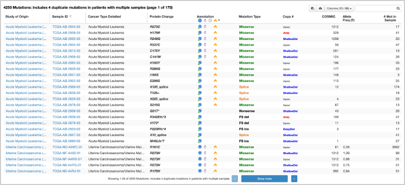

- At the top right of the table, you will see a **Columns** option, where you can select and deselect columns for the table. You need to select **ALL** columns from the **Mutations** option. Use the **Select All** option. If this was completed correctly, you should have a total of 29 columns in your table.

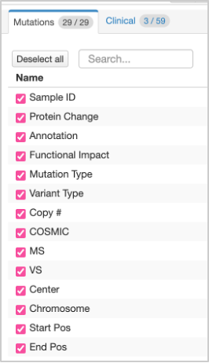

- At the top right of the table, right next to the **Columns** option, you will see a download button. If you hover over it, it will say **Download TSV**. Click this to download the TSV file.

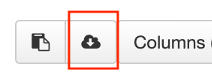

- Before using ProteinPaint we need to match the expected formatting. Open the table with Excel and edit using the following instructions. **Make sure the new column name matches the instruction exactly.**
  - Change the following column names:

| Original Column Name | New Column Name |
|----------------------|-----------------|
| Study of Origin      | disease         |
| Cancer Type          | origin          |
| Chromosome           | chromosome      |
| Start Pos            | start           |
| Protein Change       | aachange        |
| Mutation Type        | class           |

  - Add the following two new columns to the tsv file:

| New Column Name | Value     |
|-----------------|-----------|
| gene            | TP53      |
| refseq          | NM_000546 |

  - Be sure to save the file after editing!

- Go to the Protein Paint website by St. Jude: <a href="https://proteinpaint.stjude.org/" target="_blank">https://proteinpaint.stjude.org/</a>.
- Under **Launch Apps**, and select **Load Mutations from Text Files.**

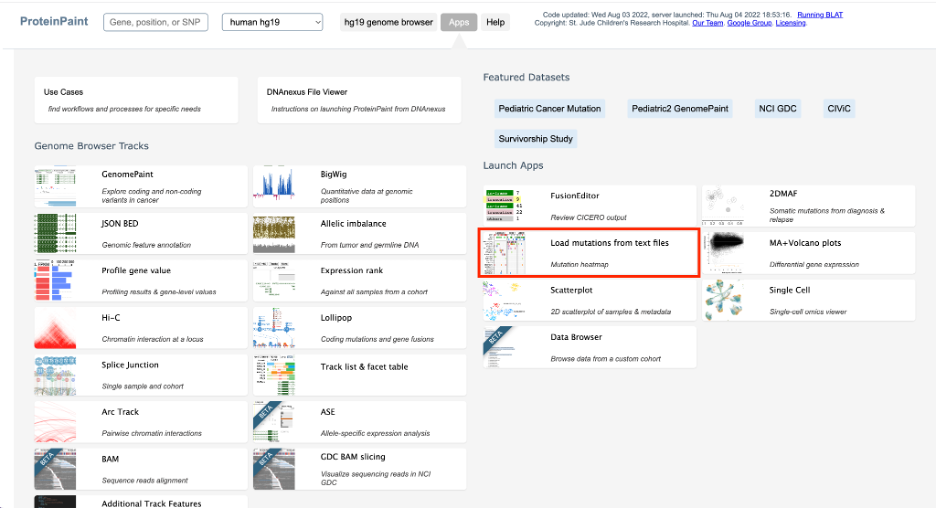

- Under the **Add Your Data** tab, use the **Choose File** button to select the edited mutation file.

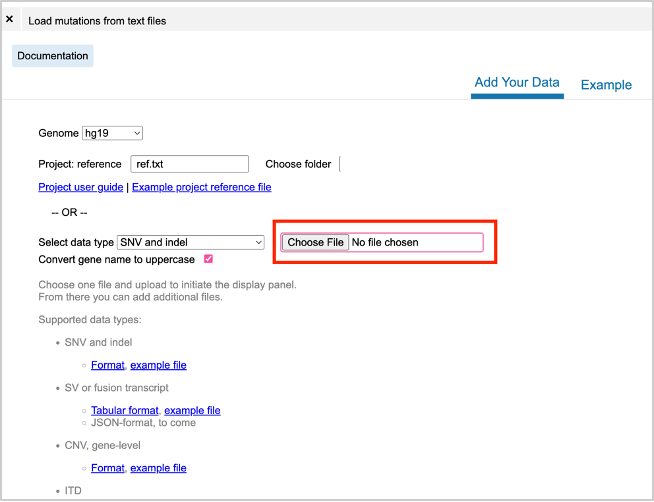

- After uploading the file, there will most likely be a pop-up regarding rejected lines, you can close this. On the left hand side of the screen there will be options for **Variants**, and **Genes**. You can view any you’d like- they are added as you click them. Click again to collapse the option.
- Make sure that the **Genes** tab is selected. Click **TP53** on the left of the **Genes** output. This will open a lollipop plot of the mutation data for the uploaded file.

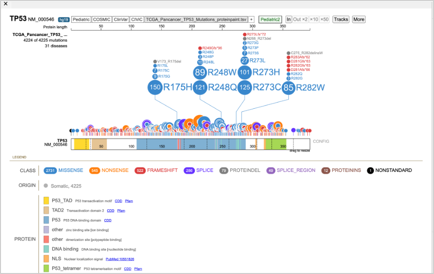

- You can add data to the plot, such as ClinVar and COSMIC. You can also select for mutations by disease type, using the link under the input file name.

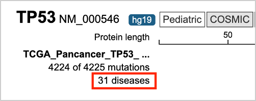
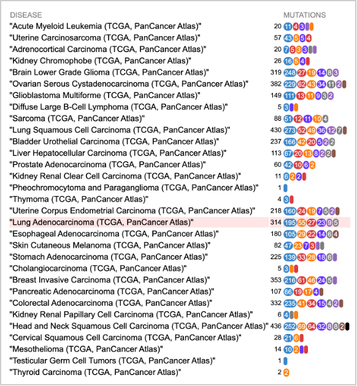

---

## Somatic analysis results from TCGA studies using FireBrowse

We will go through a quick introduction to Firebrowse, which contains analysis results and reports for a variety of cancer studies from The Cancer Genome Atlas (TCGA).

- Go to the Firebrowse website: <a href="http://firebrowse.org/" target="_blank">http://firebrowse.org/</a>.
- On the home page, you will see a list of the TCGA studies available and what information for each is included using the legend on the right hand side of the plot.
- On the left-hand side of the page, above the analyses list, use the dropdown button for **SELECT COHORT** to select **Lung adenocarcinoma (LUAD)**. When you click LUAD, the screen will update to include information for **TCGA LUAD**

---

#### How do I use FireBrowse to explore copy number driver events from TCGA studies?

- If you click on the **CopyNumber Analyses** tab, this will expand into a selection menu for copy number analyses.

- Select **CopyNumber Gistic2** from the list. This will open a report of the copy number analyses results at the arm and focal level. Click **Open in New Window** to look at the report in a separate tab.

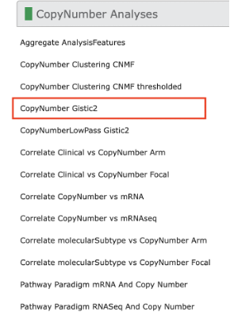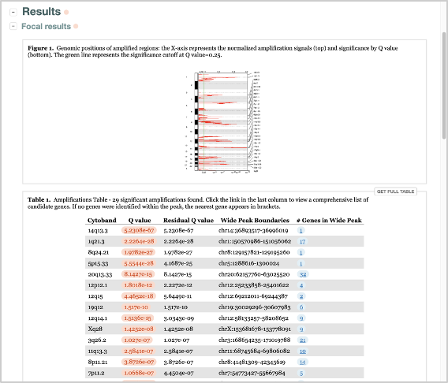

---

#### How do I use FireBrowse to explore APOBEC enrichment from TCGA studies?

- If you click on the **Mutation Analyses** tab, and select **Mutation APOBEC**, this will open a report of fold-enrichment of APOBEC mutagenesis. You should be seeing something like:

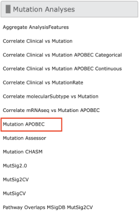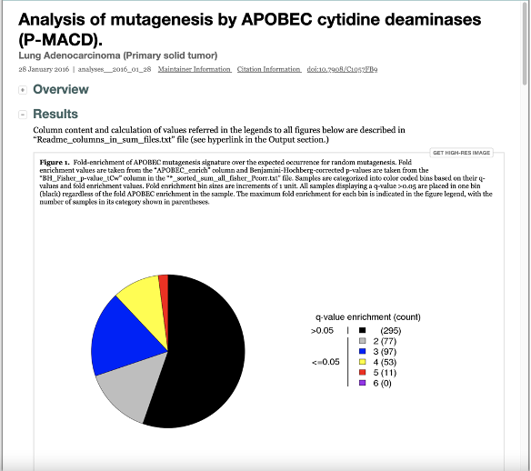

---

#### How do I use FireBrowse to explore association relationships between variables  from TCGA studies?

Firebrowse allows you to explore association relationships between variables.

- Under **Clinical Analyses**, there are a series of correlation reports. Click on **Correlate Clinical vs Mutation** for association test results for clinical variables and gene mutation status.

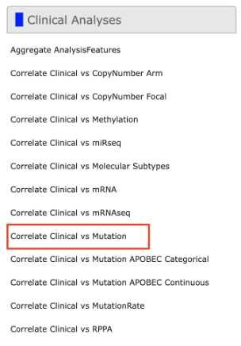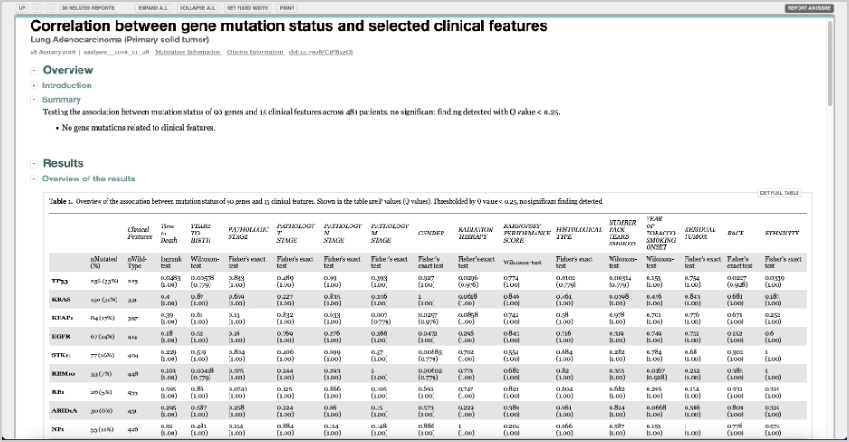

---

## Mutational signature findings from cancer genomic studies

#### How can we explore mutational signature activity at the pan-cancer level?

We can use the Signal website to explore mutational signature activity at the pan-cancer level. See the example below.

- Go to the Signal website to explore mutational signatures found in different cancer types: <a href="https://signal.mutationalsignatures.com/explore/cancer" target="_blank">https://signal.mutationalsignatures.com/explore/cancer</a>.
- On the Signal website, there is a chart that highlights the most common mutational landscape of specific cancer types with regard to known mutational signatures.

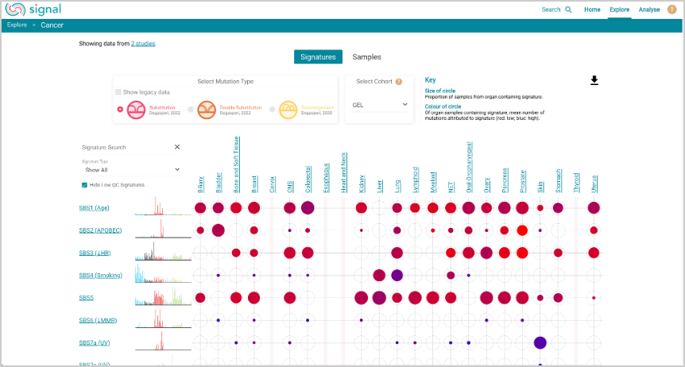

- Larger circles denote a larger number of samples from the cancer type containing the signature.  The color of the circle denotes the mean number of mutations attributed to a signature (red: low; blue: high).

- To explore the proportion of samples that contain a mutational signature, simply hover over one of the circles. For example:

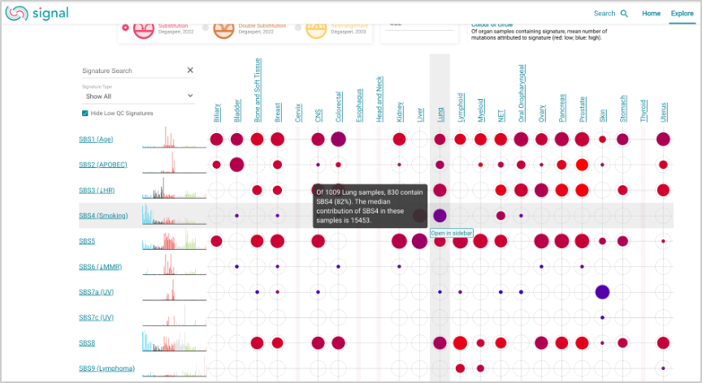

- **Here we can see that of the 1009 Lung samples, 830 (82%) contain SBS4.**
- Explore the mutational patterns for specific mutational signatures, for example, SBS4. Click the link to SBS4 on the left side of the screen in the previous screenshot. This will take you to a page that contains the SBS4 signature mutational pattern plot at the top of the page.

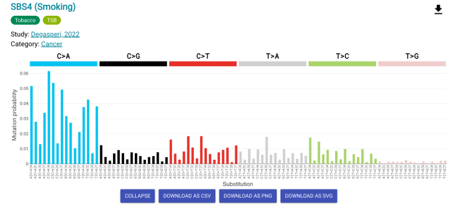

---

## Transcriptome data analysis using TCGA and GTEx

#### How do we explore the gene expression differences across different normal and tumor tissue types?

We can use the Gene Expression Profiling Interactive Analysis (GEPIA) tool to explore these gene expression differences. See the example below.

- Go to the GEPIA website: <a href="http://gepia.cancer-pku.cn/index.html" target="_blank">http://gepia.cancer-pku.cn/index.html</a>.
- Make sure the **Single Gene Analysis** tab is selected. In the search box, enter the gene SFTPB. Click the **GOPIA!** Button to submit.

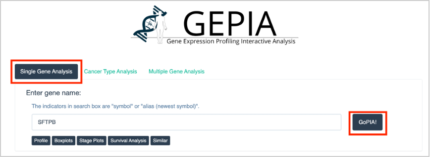

- On the screen that appears after submitting the search, click the **On/Off** button under **Log(TPM + 1) Scale** so that it is in the **On** mode.
You will see that the TPM distribution plot and barplot change when adjusting the scale.

**TPM Distribution Plot**
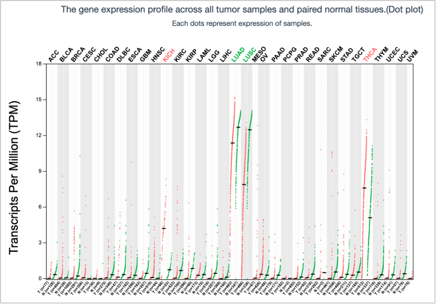

**TPM Bar Plot**
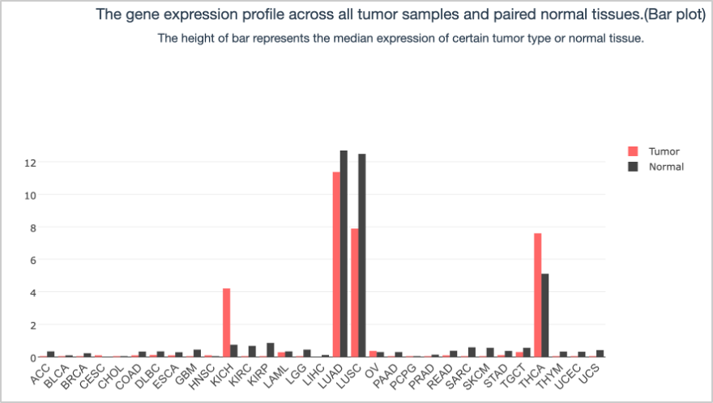

**The results show the surfactant gene SFTPB is a lung tissue-specific gene. You can also identify multiple surfactant genes with high similar scores (PCC, Pearson correlation coefficient) to SFTPB, including NAPSA, SFTPD, SFTA2, SFTA1P, etc.**

**Most Similar Genes Table**
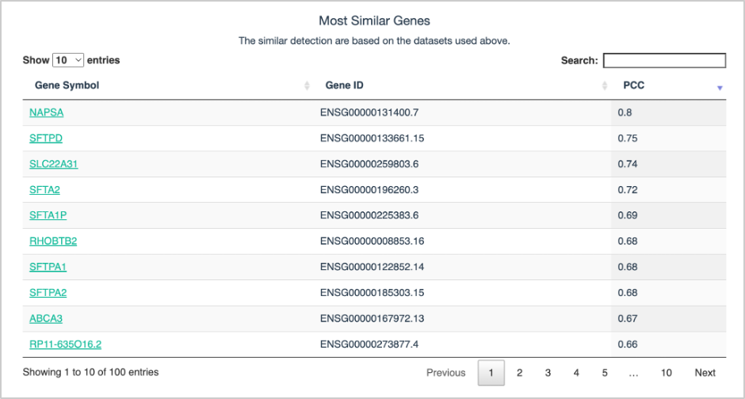

---

#### How do we explore differentially expressed genes between normal and tumor in specific cancer types?

We will use GEPIA for this as well. See the example below.

- At the top of the page, click the **Expression DIY** dropdown and select **Boxplot**.
- For the boxplot parameters, enter the following:
  - Gene: **SFTPB**
  - p-value Cutoff: **0.01**
  - Datasets Selection: **LUAD and LUSC**. (Note: Be sure to click Add for each dataset you are selecting. They should appear in the box below the list of possible datasets to select.)
  - Log Scale: **Yes**
  - Matched Normal data: **Matched TCGA normal and GTEx data**

- The input selection should look like this:

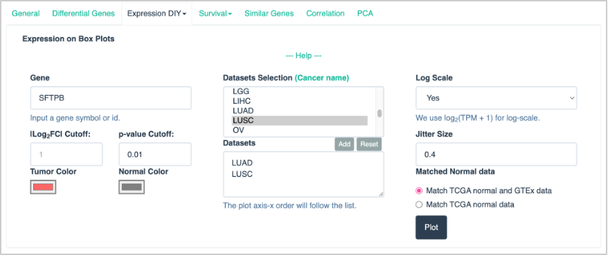

- Click **Plot**.

**As we can see, SFTPB is significantly down-regulated in both LUAD and LUSC.**

---

#### How do we conduct a correlation analysis between two genes using GEPIA?

GEPIA has a Correlation analysis method that can be used. See the example below.

- At the top of the page, click **Correlation**.
- For the correlation analysis input parameters, enter or select the following:
  - Gene A: **EGFR**
  - Gene B: **KRAS**
  - Select **LUAD Tumor** from **TCGA Tumor**. Click **Add** to add to **Used Expression Datasets**.

The input selection should look like this:

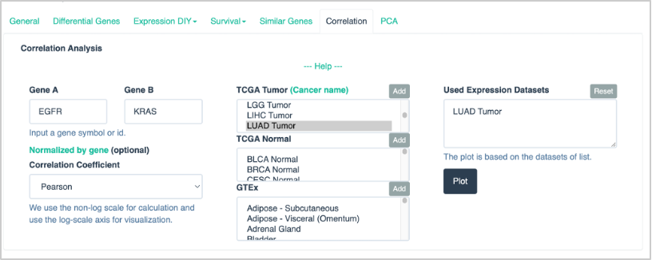

- Click **Plot**.

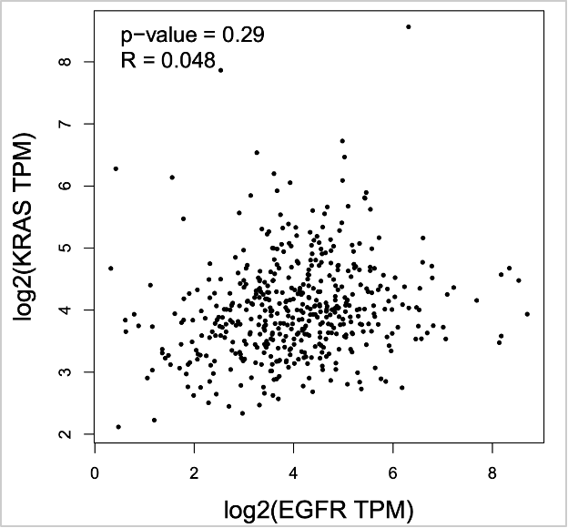

- Now let's check normal tissue. Click **Reset** for **Used Expression Datasets**. Select **LUAD Normal** from **TCGA Normal**. Click **Add** to add to **Used Expression Datasets**.

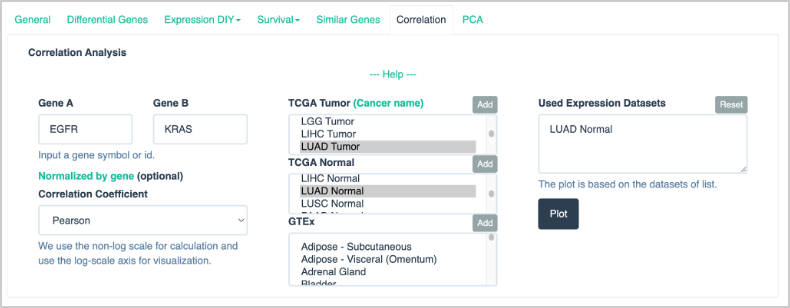

- Click **Plot**.

---

#### How do we explore gene expression associated with survival using GEPIA?

GEPIA has a Survival analysis method that can be used. See the example below.

- At the top of the page, click the **Survival** dropdown and select **Survival Plots**.
- For the survival plot input parameters, select or enter the following:
  - Gene: **TP53**
  - Methods: **Overall survival**
  - Group Cutoff: **Median**
  - Hazards Ratio (HR): **Yes**
  - Datasets Selection: **LUAD**

- The input selection should look like this:

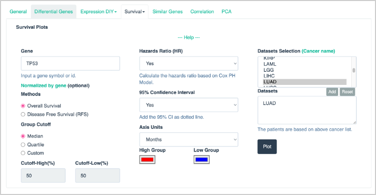

**The survival plot did not show significantly worse survival for the highly expressed TP53 group**:

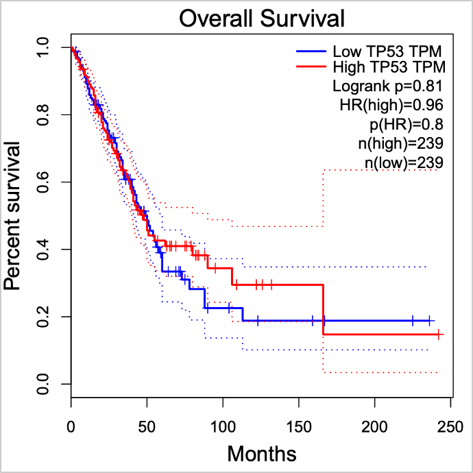

---

#### TP53 was reported to be the most strongly significantly associated with worse survival in multiple cancer types. Why did we not observe a significant association when using the gene expression data?

We can further investigate this using data available in cBioPortal.

- Go to the cBioPortal website: <a href="https://www.cbioportal.org/" target="_blank">https://www.cbioportal.org/</a>
- Search for **TCGA PanCancer** in the search box. Select the **Lung Adenocarcinoma** study.
- Select **Query By Gene** at the bottom of the page.
- Select only the **Mutations** option under **Select Molecular Profiles**.
- Enter **TP53** in the **Enter Genes** box. Submit the query.
- Under the **Comparison/Survival** tab, click the **Survival** subtab. Here we see a survival plot of those with and without TP53 mutation.

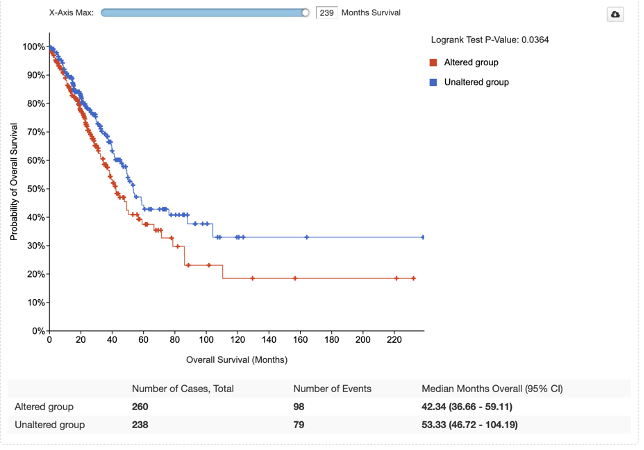

**Here we do see a significant association between TP53 mutation status and worse survival.**  

- Please note, for the survival analysis, additional covariables need to be adjusted in the final Cox Proportional-Hazards Model, such as age, gender, stage, and histology (if multiple types).
