<!--script src="{{ site.baseurl }}/assets/js/vanilla-back-to-top.min.js"></script> <script>addBackToTop()</script-->

## Introduction to NGS sequencing

A typical Next Generation Sequencing (NGS) workflow can be divided into 5 steps:

- Specimen collection - e.g. primary vs secondary tumors, tumors and/or normal tissues, liquid biopsy (blood, urine) or traditional biopsy, preservation techniques (FFPE, fresh frozen, circulating tumor cells, cell free DNA, etc.)
- Sample extraction: e.g. genomic DNA or RNA
- Library preparation: prepare samples to be compatible with the sequencer. Sequencing libraries are typically created by fragmenting DNA and adding specialized adapters to both ends. In the Illumina sequencing workflow, these adapters contain complementary sequences that allow the DNA fragments to bind to the flow cell. Fragments can then be amplified and purified.
- Sequencing: libraries are loaded onto a flow cell and placed on the sequencer. Two common sequencing platforms are Illumina and Ion Torrent.
- Data analysis & interpretation: After sequencing, the instrument software identifies nucleotides (a process called base calling) and the predicted accuracy of those base calls. The raw output from sequencers are often in FASTA format, which can be aligned to a reference genome in BAM format.

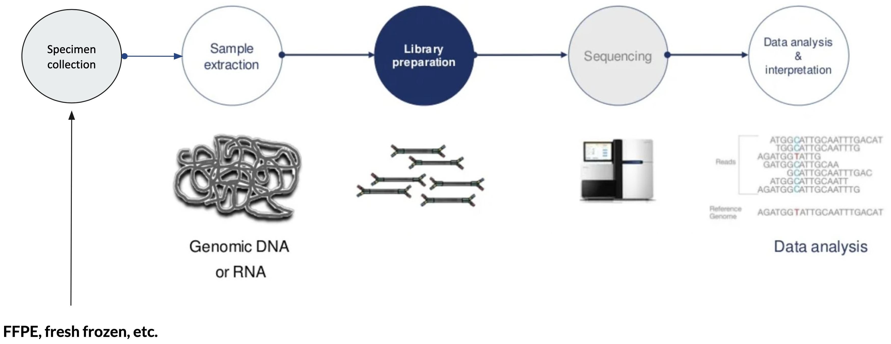
<figcaption class="has-text-centered is-size-7 is-italic">From https://www.qiagen.com/</figcaption> 

Specimen collection and the types of materials available to you (be it fresh frozen tissues, FFPE tissue samples, or other types of specimens) can impact the quality of the DNA you’re able to extract.  FFPE (formalin fixed, paraffin embedded) tissues, in particular, generally result in lower quality DNA and RNA, and can make every step of wet-lab processing more challenging. This will also impact the quality of sequencing data generated as well as the analytic strategies used downstream, and it’s important to be aware of that going into a study using those types of specimens.

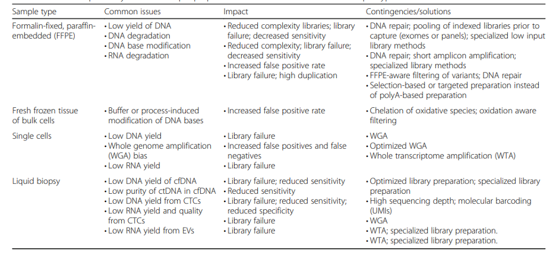
<figcaption class="has-text-centered is-size-7 is-italic ">Sample Types and their most common analytical issues. <a href="https://genomemedicine.biomedcentral.com/articles/10.1186/s13073-016-0370-4">Lennon NJ, Adalsteinsson VA, Gabriel SB, 2016</a></figcaption> 

After DNA extraction (isolation of DNA from other cellular components), it is important to assess both the quality and quantity of DNA obtained.  The results of this quality control (QC) check can impact what sequencing strategies are feasible for your samples (long read or short read, whole genome or targeted).

Once the DNA is QC’ed and the strategy is finalized, sequencing libraries are prepared in the sequencing facility. In a nutshell, DNA library prep is the process of converting genomic DNA into a format that is usable by the sequencer and also includes enrichment of genomic regions of interest if you are doing targeted sequencing. This process may include fragmenting DNA into smaller, consistently sized pieces, and always includes adding adapter sequences used for sequencing primer sites (among other purposes).

Finally, we also assess the quality and quantity of final libraries before loading them onto a sequencer using the techniques that we use to QC genomic DNA after extraction. This QC step is important to ensuring that we maximize the yield of expensive sequencing runs, achieve the coverage depth that is desired, as well as catch potential problems with the library that might generate subpar data.

---

## NGS Platforms Summary

Here we are just providing an overview of read lengths, examples of appropriate applications, and instrument names for the biggest sequencing technologies in use today.

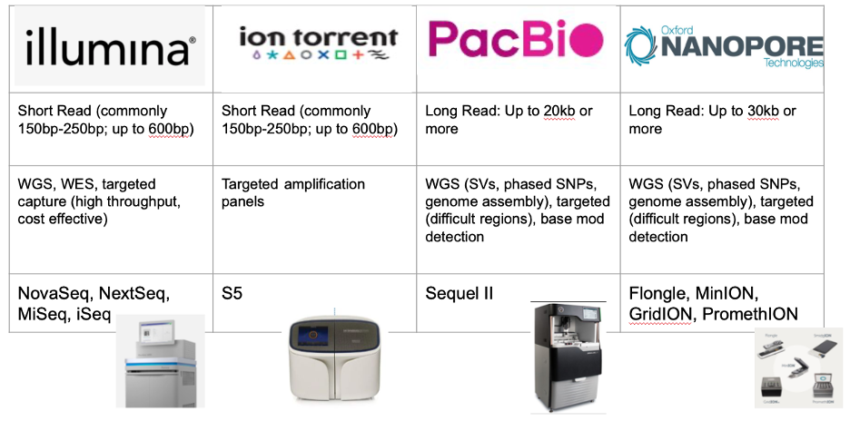

All reads within an Illumina sequencing run are same length. For other platforms, each individual read may be a bit longer or shorter.

Single cell sequencing is not shown in the list of applications here, but for now those approaches predominantly use Illumina sequencing.

In subsequent sections, we will focus primarily on Illumina and PacBio long read sequencing. This is because the vast majority of NGS sequencing data generated as of this writing is on Illumina. PacBio long read sequencing is also growing increasingly popular as cost per sample decreases. If you’re interested in the specifics of how these sequencing technologies work we will include details in the supplementary section of this section.

The figure below gives a rough picture of how each sequencing technology is used at CGR:

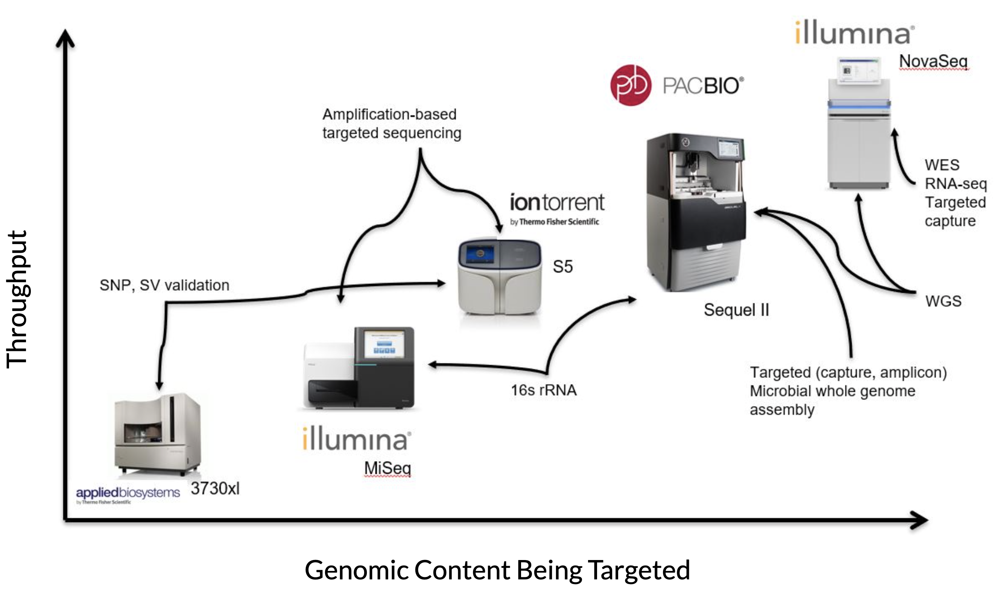

On the Y-axis is throughput (in terms of amount of data being generated), and on the X-axis is the amount of genomic content being targeted. Oxford Nanopore is not pictured, but is roughly the same as PacBio in this image.

---

### Comparison of Platforms

Below is a summary table of the differences in overall accuracy, yield, throughput, and cost per Gb for the different NGS platforms.



NGS moves fast! Costs and applications, read lengths and accuracy can change very quickly. Illumina data is still the cheapest per Gb, and the cost differences are most easily seen with WGS. It is also among the most accurate in terms of overall read accuracy.

As of this writing (October 2022), Illumina announced that they are releasing a new short read instrument and chemistry that would reduce the cost per Gb down to as low as $2/Gb, and a long read chemistry with unknown impact on the cost of long read data.  Both are set to be released next year.

---

## Sequencing Strategies

The main forms of DNA sequencing strategies are whole genome sequencing (WGS), whole exome sequencing (WES), and targeted sequencing.



Whole genome sequencing, as the name implies, sequences an entire genome including both intronic and exonic regions. Whole exome sequencing and targeted sequencing by contrast sequence subsets of the genome, namely the exome and a panel of target regions, respectively. There are many standard exome sequencing kits, as well as standard targeted sequencing panels. You can also order customized targeted sequencing panels to include certain regions (exons, introns, you name it) to better answer your research questions.

The typical average sequencing depth is around 30x or more for WGS, 50-100x or more for WES, and 500x or more for targeted sequencing. These sequencing depth guidelines are driven primarily by cost limitations. Naturally, WGS is the most expensive, followed by WES and targeted sequencing.

Do note that if you are looking for somatic mutations in tumor tissue or other features present in a low fraction of your DNA molecules you will likely need to sequence more deeply than 30x. In the example of our Sherlock Lung study, we sequenced germline tissue 30x and tumor tissue 80x. Coverage depths shown here are rough guidelines, but how much depth you need should be dictated by what you’re looking for.

---

### Targeted Sequencing Details

Targeted sequencing sequences key genes or regions of interest to high depth (500–1000× or higher), allowing identification of rare/established variants. This provides cost-effective findings for studies of disease-related genes and delivers accurate, easy-to-interpret results, identifying causative novel or inherited mutations at low allele frequencies (down to 5%). The two common methods for targeted sequencing are target enrichment (hybridization capture) and amplicon generation.

|                                                                                                                  |                                    Hybridization Capture                                    |                          Amplicon Sequencing                          |
|-------------------------------------------------------------------------------------------------------------------------|:-------------------------------------------------------------------------------------------:|:---------------------------------------------------------------------:|
| **Principle**                                                                                                           | Capture by hybridization to biotinylated probes & isolated by magnetic pulldown             | Amplified and purified using pools of carefully designed oligo probes |
| **Size**                                                                                                                | 20kb–62Mb regions. Typically >50 genes                                                      | A few to hundreds of genes in a single run. Typically <50 genes       |
| **Sample input**                                                                                                        | Higher input required (10-100ng)                                                            | Lower sample input required (needle biopsy aspirate or cDNA) (>1ug)   |
| **Variant types**                                                                                                       | More comprehensive for all variant types                                                    | Ideal for SNVs and indels                                             |
| **Homologous regions (e.g. pseudogenes)  Hypervariable regions (e.g. TCR)  Di/Tri nucleotide repeat regions (e.g. MSI)** | Difficulty distinguishing between the regions, resulting in non-specific enrichment         | Better enrichment with specifically designed PCR primers              |
| **Overall**                                                                                                             | More comprehensive method, but more expensive with longer hands-on time and turnaround time | Less comprehensive, more affordable, and easier workflow              |

In hybridization capture, the targeted regions are captured by hybridization to biotinylated probes and are then isolated by magnetic pull down. For amplicon sequencing, the regions are amplified and purified by using a pool of carefully designed oilgonucleotide probes

Overall, hybridization capture often covers larger regions of the genome and is more comprehensive for more variant types, but it also requires more DNA input, longer hands-on and turn around time, and is more expensive. In contrast amplicon sequencing requires a lower amount of DNA input, which is particularly helpful when the DNA comes from a low yield source such as needle biopsy aspirate or cDNA.

When studying more challenging regions like homologous regions, hypervariable regions and di/tri nucleotide repeat regions, amplicon sequencing could show better enrichment with specifically designed PCR primers. Hybridization capture might have difficulty distinguishing between these regions, resulting in non-specific enrichment. As an example, PTEN is a known tumor suppressor gene and is one of the most commonly mutated suppressor genes in cancer. PTENP1 is a processed pseudogene very similar in sequence. Being able to distinguish between the two would be essential, and is more likely with amplicon sequencing.

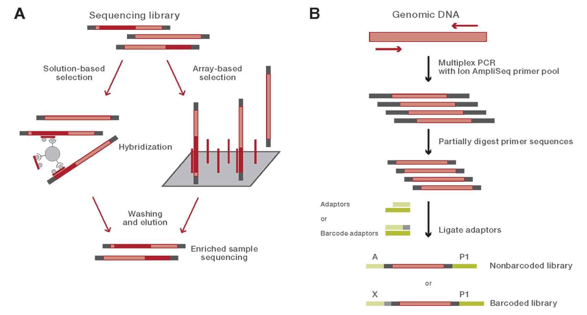
<figcaption class="has-text-centered is-size-7 is-italic">A) Target enrichment, B) Amplicon sequencing. <a href="https://www.thermofisher.com/us/en/home/life-science/sequencing/sequencing-learning-center/next-generation-sequencing-information/ngs-basics/targeted-sequencing-approaches.html">From Thermo Fisher</a></figcaption> 

---

### Target Panels

There are targeted panels for many diseases and purposes, but some of the most common panels for cancer research are highlighted below.

|             Gene Panel            | Gene Count | Sample Type |                        Variants                       |                                                                              Notes                                                                              |
|:---------------------------------:|:----------:|:-----------:|:-----------------------------------------------------:|:---------------------------------------------------------------------------------------------------------------------------------------------------------------:|
| **Oncomine Comprehensive Plus**   | 500+       | DNA,  RNA   | SNVs, indels, CNVs, fusions, splice variants          | Include TMB and MSI assays for potential immunotherapy applications. Also assess 46 genes in HRR pathway                                                        |
| **TruSight RNA Pan-Cancer Panel** | 1385       | RNA         | SNVs, indels,  fusions, novel transcripts, expression | Enables quantitative measurement of gene expression as well as the detection of gene fusions with both known and novel gene fusion partners.                    |
| **MSK-IMPACT**                    | 505        | DNA         | SNVs, Indels, CNVs, fusions                           | Includes genes important in development and behaviour of tumors nominated by researchers and experts from across MSK. All actionable targets are also included. |

As you can see they are very different in terms of the number of genes covered, the type of sample input, and the type of variants and assays detected. For instance, the Oncomine Comprehensive Plus one also includes TMB and microsatellite instability assays as well as genes in the homologous recombination repair pathways.

The MSK-Impact panel developed by Memorial Sloane Kettering Center includes many genes nominated by researchers and experts from across MSK.

With these panels you can always customize them to include specific genes or regions of interests.

See [this list](https://www.mygenomics.com/cancer-panels-gene-list/) of various cancer panels and the genes they include. This list is not meant to be comprehensive; there are many more targeted panels beyond those mentioned here.

---

### WES Capture Platforms

Below we summarise the most common WES capture platforms.

|                 Platform                 |      Target Capture Region Length      | Required input quantity |                                                    Bed file links                                                    |
|:----------------------------------------:|:--------------------------------------:|:-----------------------:|:--------------------------------------------------------------------------------------------------------------------:|
| **Agilent SureSelect Human All Exon v8** | 35.1 Mb                                | 10-400ng of DNA         | [Targets BED file](https://kb.10xgenomics.com/hc/en-us/articles/115004150923-Where-can-I-find-the-Agilent-Target-BED-files-)           |
| **Roche KAPA HyperExome**                | 43 Mb - targeting hg38 genome assembly | 100ng DNA               | [Download HG38 Design Files for the KAPA HyperExome Probes](https://sequencing.roche.com/content/dam/rochesequence/worldwide/design-files/KAPA%20HyperExome%20Design%20files%20HG38.zip) [Download hg19 Design Files for the KAPA HyperExome Probes](https://sequencing.roche.com/content/dam/rochesequence/worldwide/design-files/KAPA%20HyperExome%20Design%20files%20hg19.zip)  |
| **Illumina TruSeq**                      | 45 Mb                                  | 100ng of DNA            | [Targets BED file](https://emea.support.illumina.com/downloads/truseq-exome-product-files.html)                                         |

Note that these details and common platforms may change over time.

---

## Sequencing Strategies and Study Design

Which sequencing strategy to use can be dependent on your study design and specific research questions.

For example, to study coding driver genes, WES and WGS could be used for de novo discovery of driver genes and WES is often preferred as the exome regions are often sequenced to a much greater depth than WGS. Targeted panel sequencing is helpful when you have a set of pre-defined genes or regions you want to examine.

For studying non-coding variants, structural variants, tumor evolution, copy number alterations, mutational signatures, and gene fusions, WGS is certainly the best strategy. Targeted and WES could also be used but they are limited to examining a set of defined genes or regions or just the exome regions respectively.

|       Research area       |      Targeted Panel      |                WES               |                WGS                |
|:-------------------------:|:------------------------:|:--------------------------------:|:---------------------------------:|
| **Coding driver genes**   | Pre-defined genes only   | Yes - De novo discovery possible | Yes - De novo discovery possible  |
| **Non-coding**            | Pre-defined regions only | No                               | Best                              |
| **Structural variant**    | Limited                  | Limited                          | Best                              |
| **Tumor evolution**       | Limited                  | Limited                          | Best                              |
| **Copy number analysis**  | Limited                  | Limited                          | Best                              |
| **Mutational signatures** | Being developed          | Limited and potentially biased   | Best                              |
| **Gene fusion**           | Pre-defined regions only | Limited                          | Best - De novo discovery possible |

There are approaches currently being developed within DCEG to study mutational signatures using targeted sequencing. WES can provide some information about mutational signatures, but it’s limited and potentially biased compared to WGS.

---

### Benefits of Long Read Sequencing

Recently, there is an emerging interest in using Long Reads sequencing (LRS) as they could overcome certain shortcomings compared to Illumina short read WGS. For instance, LRS does not rely on PCR hence there are no amplification biases due to GC content, which could influence copy number estimation with short reads. LRS also has increased sensitivity and accuracy for structural variant identification, can better resolve repetitive regions for genome assembly, can better identify reads derived from pseudogenes, and allows for haplotype phasing.

|                        Study Design                        |                                               Short Read WGS (SRS, e.g. Illumina)                                              |                                 Long Read Sequencing (LRS, e.g. PacBio)                                |
|:----------------------------------------------------------:|:------------------------------------------------------------------------------------------------------------------------------:|:------------------------------------------------------------------------------------------------------:|
| **Copy Number Estimation**                                 | Relies heavily on PCR -> GC content bias (dependence between read coverage and GC content) -> influence copy number estimation | Does not rely on PCR -> Unbiased by GC content                                                         |
| **Structural Variants (SVs)**                              | Limited mostly to small SVs                                                                                                    | Increased sensitivity and accuracy, better detection of large SVs (>50bp)                              |
| **Genome Assembly and Resolution of Repeat-Heavy Regions** | Limited resolution for repetitive regions                                                                                      | “Close the gaps” in the genome assembly Higher resolution for repetitive regions                       |
| **Haplotype Phasing**                                      | Direct phasing is limited as SNVs are required to be on the same reads                                                         | Increased sensitivity and accuracy                                                                     |
| **Pseudogenes**                                            | Homologous pseudogenes might impact mapping rates and variants calling in functional counterparts                              | Better distinguishing of pseudogenes vs functional counterparts. Better identification of pseudogenes |

Haplotype phasing is the problem of inferring information about an individual’s haplotype. To do haplotype phasing, one needs some information that allows us to connect the two SNPs so that one can infer which variants lie on the same chromosome. If you do not have a single read that spans the two positions, then you don’t have any information about the connection between the two SNPs.

---

### Sequencing Strategy Practical Details

Finally there's the matter of cost, which is a constant limiting factor in NGS experiments. It’s important to note here that price can change rapidly, and different sequencing labs may have different input requirements or instrument configurations that might affect cost per sample. Prices listed here are from CGR as a point of reference. Choosing to generate deeper coverage than shown here for tumor/somatic sequencing will naturally increase the price.

|                             | Targeted Sequencing |               WES               |               WGS              |
|-----------------------------|:-------------------:|:-------------------------------:|:------------------------------:|
| **Cost (per sample)**       | $50-200             | $90-200                         | $600-1500                      |
| **DNA Quantity Required**   | 50-200ng            | 50-200ng                        | 200-1000ng (PCR free)          |
| **DNA Quality Required**    | Amenable FFPE       | Amenable to FFPE                | FFPE not generally used        |
| **Standard Coverage Depth** | >100x               | >40x (germline) >100x (somatic) | >30x (germline) >80x (somatic) |
| **Samples (Per Run)**       | Up to 384           | Up to 384                       | Up to 48                       |

Also important to note: If you are looking for mutations in tumors, it is often recommended to sequence either a normal tissue sample or germline DNA sample like blood from the same subject, in addition to the tumor tissue. This allows you to more easily differentiate tumor-specific mutations, but adds to the cost of the experiment.

Lower quality DNA samples like FFPE may not be the best fit for WGS, and you’ll notice that the input requirement for quantity is higher than other approaches as well. In general, WGS requires more and higher quality DNA simply because it’s an expensive assay. While it’s technically possible to do WGS with lower input or lower quality DNA if that is all that's available, many analyses will not be possible and you may get poor return on your investment.

---

### Practical details for PacBio/LRS

Once again we'd like to draw your attention to the quality and quantity requirements for PacBio, which are very high. For PacBio WGS there is a lower input protocol, but it comes with caveats. The large amount of DNA required for PacBio LRS is due to the fact that there is no PCR amplification whatsoever in the process. This is a plus when it comes to data quality, but it can be challenging to get enough DNA for the protocol.

Once again, prices listed are from CGR. Targeted sequencing costs vary considerably depending on how you enrich for regions of interest (targeted panel sequencing, or long range PCR of just 1 or a few regions).

|                             | Targeted Sequencing | WES |        WGS        |
|-----------------------------|:-------------------:|:---:|:-----------------:|
| **Cost (per sample)**       | $15-$200            | N/A | ~$1500-5000       |
| **DNA Quantity Required**   | 50-500 ng           |     | **>3-5 ug**       |
| **DNA Quality Required**    | High quality        |     | **Very high quality** |
| **Standard Coverage Depth** | >100x               |     | 10-30x            |
| **Samples (Per Run)**       | 12-384              |     | 1                 |

The coverage depths listed are on the lower end as deeper coverage for human WGS is usually cost prohibitive. 10-30x coverage WGS may be sufficient for phasing SNPs and for identifying many structural variants (though again, deeper coverage may be needed for somatic variants). Because most exons are pretty short, WES is generally not done with PacBio as you would lose many of the advantages of long-read sequencing when looking at short exons.

---

## Quality Control

Quality control of NGS sequencing should be performed at many levels in the process, including some which we’ve mentioned already in this lecture.

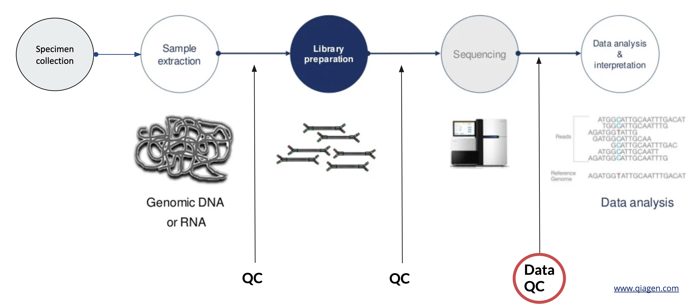

After sequencing is completed we will want to evaluate a variety of quality metrics, both before and after we map our sequence reads to a reference genome. For some of these metrics, there will not be a universal threshold that applies to all applications, and what is expected might vary depending on the application or sample type. Most of the examples we'll present are for Illumina data, but some of these checks are relevant for data from other platforms, too.

Here is a list of the most important QC screens to perform on your data pre- and post-alignment (though this is not exhaustive):

- QC before read mapping
  - Flowcell and sequencing quality metrics
  - Tools: FastQC, FASTX toolkit
- QC after read mapping
  - Coverage and depth metrics
  - Duplication rates
  - Insert Size
  - Mapping quality
  - Inter-sample contamination, sex concordance, relatedness
  - Tools: samtools, picard, verifybamid, FASTQ screen, somalier

There are many more quality metrics and tools available for performing QC of sequencing data. We will practice using most of the tools listed above in the practical section.

---

### Data QC before read mapping

The first metrics you will want to check is the quality of the overall sequence run on the instrument, namely overall yield and base calling quality.  There are several metrics that can demonstrate these both at the sample and flowcell level, and the lab generating the data should be able to provide these. These metrics include the total yield, error rates, Q30%, and passed filter reads, as probably among the more important. Low yield will negatively impact coverage, and poor quality will lead to errors in mapping and variant calling.

One of these metrics that I’ve mentioned that is helpful to understand is the Q30%.


<figcaption class="has-text-centered is-size-7 is-italic"><a href="https://www.illumina.com/documents/products/technotes/technote_Q-Scores.pdf">From Illumina</a></figcaption> 

Q30% refers to the percentage of bases generated that meet or exceed a quality score of Q30, which translates to a base having a 1 in 1000 chance of being incorrect. Most sequence data (not just Illumina) is assigned these phred-scale quality scores in the fastq files, and understanding the difference between Q20, Q30, Q40, etc. is important.

The flowcell-level metrics provided by the sequencing facility should meet Illumina’s specs for a given instrument run, which can be found on [Illumina’s website](https://www.illumina.com/systems/sequencing-platforms/novaseq/specifications.html).

Once you know the overall sequence run performed well, you will want to examine some sample-level metrics that assess the quality of your reads per sample. FastQC and the FASTX toolkit are both tools that can be used to evaluate the quality of your reads.

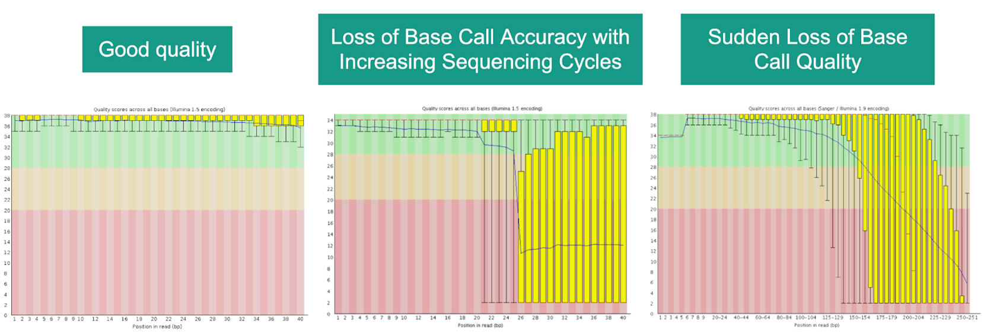

FastQC can show read lengths, positional information about read quality, read lengths, GC content, and whether adapter sequences are present or were trimmed. Recall from the beginning of this lecture that adapters are DNA sequences that are added to our genomic DNA fragments and are used by the sequencer as priming sites for generating sequence reads.  If sequencing reads are longer than the DNA fragments, the sequencer will continue sequencing into the adapters. Adapter sequences should be trimmed to avoid errors during mapping and variant calling. Often sequencing facilities will perform some adapter trimming for you, but these tools can help identify whether more adapter trimming is still necessary or not.

We will practice using FastQC and performing read trimming during this session's practical.

---

## Data QC after read mapping

After fastq files are QC’ed and reads are aligned to the reference genome, additional QC should be done on the aligned reads/BAM files. Among the most important of these are:

- Coverage and depth metrics
- Duplication rates
- Insert Size
- Mapping quality
- Inter-sample contamination, sex concordance, relatedness

---

### Duplicate Reads

Duplicate reads are reads represented more than once in an NGS sample and are generally caused by PCR amplification prior to sequencing. Duplicate rates are usually evaluated with Samtools and Picard, and can be approximated before alignment using FastQC. For most DNA sequencing applications, extra copies of the same molecule should be removed from the data leaving only unique sequences. This is because duplicates can lead to false-positives during many analyses downstream.

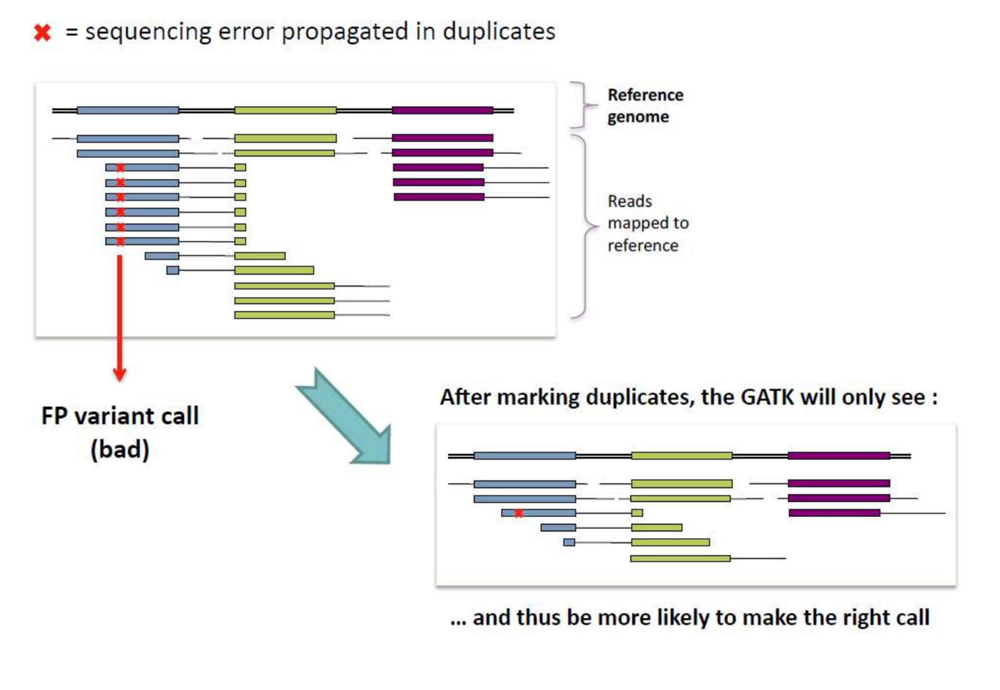

Note that high duplication rates will lead to lower effective coverage. Duplication rates are expected to vary depending on your sequencing strategy; by virtue of how much DNA is being sequenced, targeted and exome sequencing are expected to have higher rates of duplication than WGS.

---

### Insert Size

Insert size vs read length is a common point of confusion. Read length is the length of a sequencing read, whereas insert size is the length of the DNA fragment being sequenced. Insert size is calculated as the distance between where the first base of read 1 maps and where the first base of read 2 maps in the genome. FFPE and other degraded samples notoriously have much smaller insert sizes than fresh frozen counterparts due to degradation/fragmentation of the DNA.

In a good case, the insert size should be slightly larger than the sum of the two paired reads. In a worst case scenario, both reads in a pair will sequence the entire DNA insert as well as the adapters.

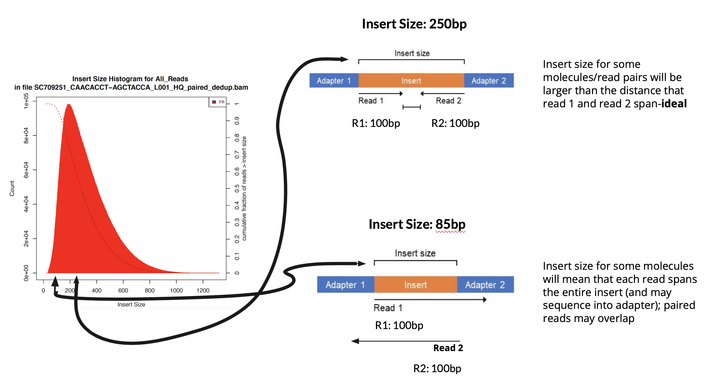
<figcaption class="has-text-centered is-size-7 is-italic">Left: a histogram of insert sizes from an NGS sequencing experiment. Right: diagram of insert size and read length. Arrows indicate where these theoretical inserts on the right would fall in the histogram.</figcaption> 

If both reads in a pair sequence most or the entire insert, then these two reads are effectively duplicates on opposite strands of the genome, and therefore your effective coverage will be much lower than you expect. Furthermore your reads are likely to contain some adapter content, which will mean shorter reads after adapter trimming.

---

### Coverage Depth

After read mapping and deduplication, coverage depth is calculated at each location being targeted by sequencing. Coverage is generally reported as the mean depth across all target regions, or as the depth on a per-contig basis (i.e. coverage depth per chromosome). Some regions might have deeper or shallower coverage than the mean, owing to GC content biases during PCR, ease of read mapping to the region, etc.

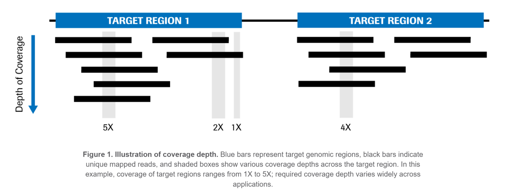
<figcaption class="has-text-centered is-size-7 is-italic"> <a href="https://sequencing.roche.com/en-us/science-education/education/articles/metrics-for-target-enriched-ngs.html">From Roche</a> </figcaption> 

If your coverage depth is low, it’s more difficult to call variants with confidence, in particular for somatic variants present at a low level in the sample.

---

### Contamination

Sample contamination can take one of two forms: inter-sample contamination and inter-species contamination. In the former (and more typical) case, DNA from one human sample contaminates another sample. Inter-sample contamination can happen at any point in the process, or in any type of assay, and the impact of high levels of this type of contamination are that you end up with false variant calls.

Inter-species contamination is most common in WGS, especially with oral/saliva samples, because WGS is not selective of which DNA it sequences. Contamination sources include bacteria to cow to pig and chicken, sometimes depending on what someone has had for lunch and the collection protocols for the specimens. This QC step could technically be performed either before or after mapping (FastQ Screen is one such tool). The impact of high levels of inter-species contamination are potentially two fold: if the contaminating reads don’t map, your coverage will be reduced. If they do map, it can lead to false-positive variant calls.

---

### Sex Concordance and Relatedness

Sex concordance (i.e. how observed sample sex relates to expected sample sex) is important because it can be a marker for sample swaps or data entry errors that can impact your analyses. If you think that a subject is female and your sequencing data indicates they are male, you may want to review your metadata and perhaps remove this sample.

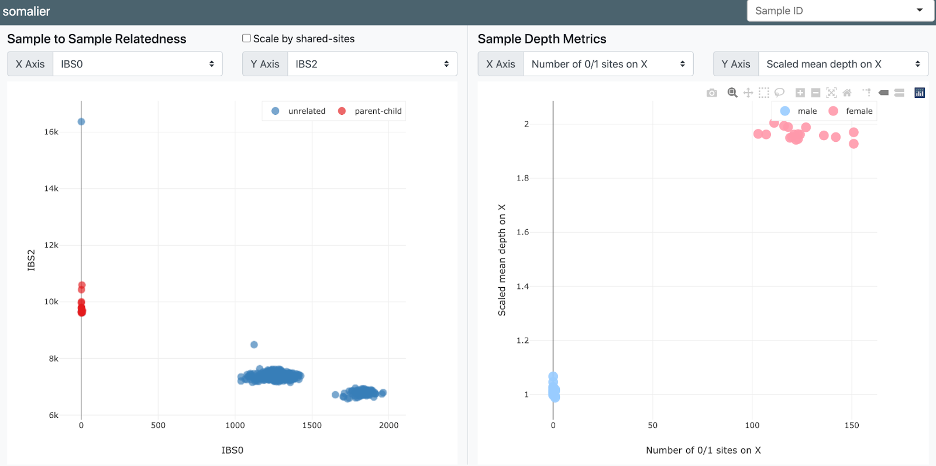
<figcaption class="has-text-centered is-size-7 is-italic">Sex concordance performed with Somalier</figcaption> 

You may also want to examine the relatedness of your samples. You may find, for instance, that two paired samples from the same individual (e.g. germline and tumor tissue) are actually not related, or that samples from different individuals are highly related unexpectedly. These can be additional indicators of sample swaps that might be missed from sex concordance alone.
